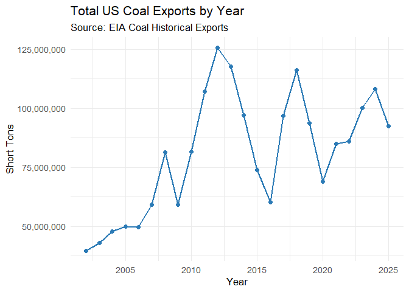
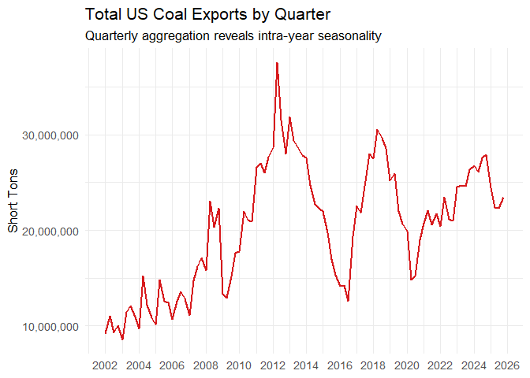
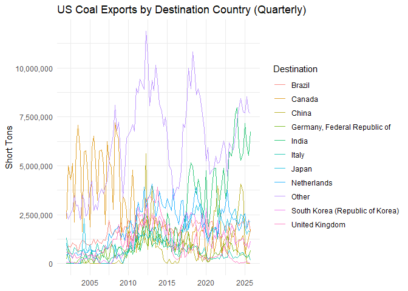
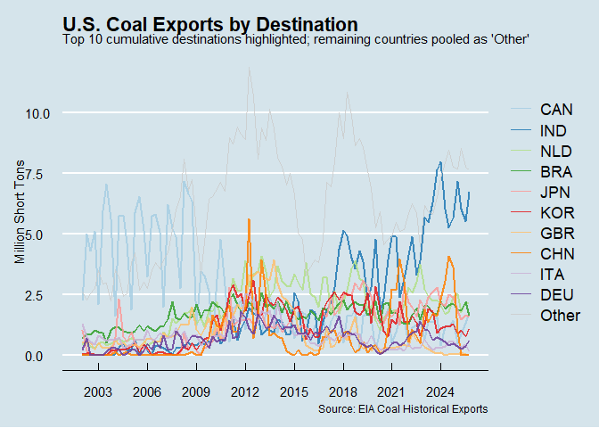
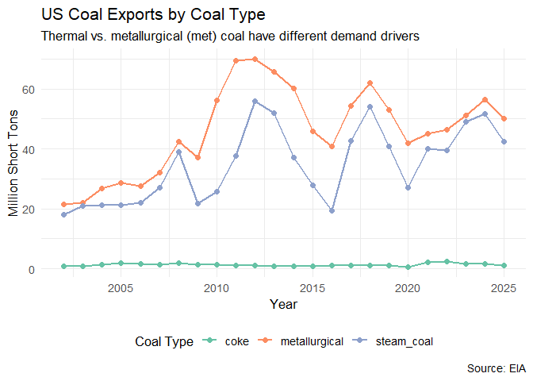

## Preliminaries

### Load libraries


``` r
if (!requireNamespace("pacman", quietly = TRUE)) {
  install.packages("pacman")
}

pacman::p_load(
  httr,        # download files from web
  readxl,      # read Excel files
  here,        # relative file paths
  tidyverse,   # dplyr, ggplot2, tidyr, etc.
  janitor,     # clean_names()
  scales,      # comma labels
  ggthemes,    # extra ggplot themes
  plotly,      # interactive plots
  countrycode, # country codes
  lubridate,   # dates
  tsibble      # yearquarter() and scale_x_yearquarter()
)
```

### Read in the data


``` r
url <- "https://www.eia.gov/coal/archive/coal_historical_exports.xlsx"

if (!dir.exists(here::here("data"))) {
  dir.create(here::here("data"), recursive = TRUE)
}

GET(url, write_disk(here::here("data/coal_historical_exports.xlsx"), overwrite = TRUE))
```

```
## Response [https://www.eia.gov/coal/archive/coal_historical_exports.xlsx]
##   Date: 2026-04-28 22:18
##   Status: 200
##   Content-Type: application/vnd.openxmlformats-officedocument.spreadsheetml.sheet
##   Size: 997 kB
## <ON DISK>  E:\AEC 699\HW02\Scripts\data\coal_historical_exports.xlsx
```


``` r
coal <- read_xlsx(here::here("data/coal_historical_exports.xlsx"), skip = 3, na = ".")
```

---

## 1) Clean the column names

The raw column names from EIA come with a mix of spaces, capitalization, and
special characters. I standardise them with `janitor::clean_names()`, which
converts everything to lowercase `snake_case` and replaces spaces / special
characters with underscores.


``` r
coal <- coal |> clean_names()

# Inspect
names(coal)
```

```
##  [1] "year"                     "quarter"                 
##  [3] "type"                     "customs_district"        
##  [5] "coal_origin_country"      "coal_destination_country"
##  [7] "steam_coal"               "steam_revenue"           
##  [9] "metallurgical"            "metallurgical_revenue"   
## [11] "total"                    "total_revenue"           
## [13] "coke"                     "coke_revenue"
```

``` r
head(coal)
```

```
## # A tibble: 6 × 14
##    year quarter type         customs_district coal_origin_country
##   <dbl>   <dbl> <chr>        <chr>            <chr>              
## 1  2002       1 Coal Exports Anchorage, AK    United States      
## 2  2002       1 Coal Exports Baltimore, MD    United States      
## 3  2002       1 Coal Exports Baltimore, MD    United States      
## 4  2002       1 Coal Exports Baltimore, MD    United States      
## 5  2002       1 Coal Exports Baltimore, MD    United States      
## 6  2002       1 Coal Exports Baltimore, MD    United States      
## # ℹ 9 more variables: coal_destination_country <chr>, steam_coal <dbl>,
## #   steam_revenue <dbl>, metallurgical <dbl>, metallurgical_revenue <dbl>,
## #   total <dbl>, total_revenue <dbl>, coke <dbl>, coke_revenue <dbl>
```


---

## 2) Total US coal exports over time (year only)

I aggregate all export tonnage to the annual level and plot a simple time
series.


``` r
# The year column should be identified after cleaning; inspect if needed
# Typical clean column names: year, quarter, coal_type, customs_district,
#                             destination_country, total (short tons)

coal_year <- coal |>
  group_by(year) |>
  summarise(total_exports = sum(total, na.rm = TRUE), .groups = "drop")

ggplot(coal_year, aes(x = year, y = total_exports)) +
  geom_line(color = "#2c7bb6", linewidth = 1) +
  geom_point(color = "#2c7bb6", size = 2) +
  scale_y_continuous(labels = scales::comma) +
  labs(
    title    = "Total US Coal Exports by Year",
    subtitle = "Source: EIA Coal Historical Exports",
    x        = "Year",
    y        = "Short Tons"
  ) +
  theme_minimal(base_size = 13)
```

<!-- -->

**Secular trends observed:** US coal exports were relatively flat through the
early 2000s, then increase sharply from around 2008–2012. After the 2012 peak, exports declined substantially. A brief partial recovery in certain years is visible but the long-run trend from the peak is clearly downward, consistent with the global energy transition narrative.

---

## 3) Total US coal exports over time (year AND quarter)


``` r
coal_quarter <- coal |>
  group_by(year, quarter) |>
  summarise(total_exports = sum(total, na.rm = TRUE), .groups = "drop") |>
  # Convert to actual date: use first month of each quarter
  mutate(
    date = yq(paste0(year, " Q", quarter))
  )

ggplot(coal_quarter, aes(x = date, y = total_exports)) +
  geom_line(color = "#d7191c", linewidth = 0.8) +
  scale_x_date(date_breaks = "2 years", date_labels = "%Y") +
  scale_y_continuous(labels = scales::comma) +
  labs(
    title    = "Total US Coal Exports by Quarter",
    subtitle = "Quarterly aggregation reveals intra-year seasonality",
    x        = NULL,
    y        = "Short Tons"
  ) +
  theme_minimal(base_size = 13)
```

<!-- -->

**Seasonality:** The quarterly plot does reveal within-year variation that is
smoothed away by annual aggregation. Coal exports tend to be higher in Q1 and Q4
(winter heating demand in global markets) and softer in Q2–Q3. This how the coal
exports fluctuate with the seasons.

---

## 4) Exports by destination country

### 4.1) Create `coal_country`


``` r
coal_country <- coal |>
  group_by(coal_destination_country, year, quarter) |>
  summarise(total_exports = sum(total, na.rm = TRUE), .groups = "drop")

print(coal_country)
```

```
## # A tibble: 5,750 × 4
##    coal_destination_country  year quarter total_exports
##    <chr>                    <dbl>   <dbl>         <dbl>
##  1 Albania                   2016       4            74
##  2 Albania                   2023       2         24152
##  3 Algeria                   2002       1        129305
##  4 Algeria                   2002       3         62931
##  5 Algeria                   2002       4        129563
##  6 Algeria                   2003       1        128525
##  7 Algeria                   2003       2         70539
##  8 Algeria                   2003       3        141813
##  9 Algeria                   2003       4         66499
## 10 Algeria                   2004       1        141438
## # ℹ 5,740 more rows
```

### 4.2) Inspect the data frame


``` r
# How many unique year-quarter combos exist in the full data?
all_periods <- coal_country |>
  distinct(year, quarter) |>
  nrow()

# How many does Albania actually appear in?
albania_periods <- coal_country |>
  filter(coal_destination_country == "Albania") |>
  nrow()

cat("Total year-quarter periods in dataset:", all_periods, "\n")
```

```
## Total year-quarter periods in dataset: 96
```

``` r
cat("Periods with Albania data:", albania_periods, "\n")
```

```
## Periods with Albania data: 2
```
**Reason:**Albania appears in fewer observations than the total number of year–quarter periods. This reflects an implicit missing data issue: the missing values are not recorded as NA; instead, the corresponding rows are absent from the dataset. This typically occurs because the U.S. did not export to certain countries, such as Albania, in some periods, so no record was generated for those country–time combinations. 

### 4.3) Complete the data frame

I use `tidyr::complete()` to create all possible country × year × quarter
combinations, filling the implicitly missing export values with `0`.


``` r
coal_country <- coal_country |>
  complete(
    coal_destination_country,
    year    = full_seq(year, 1),
    quarter = 1:4,
    fill    = list(total_exports = 0)
  ) |>
  arrange(coal_destination_country, year, quarter)

print(coal_country)
```

```
## # A tibble: 14,592 × 4
##    coal_destination_country  year quarter total_exports
##    <chr>                    <dbl>   <dbl>         <dbl>
##  1 Albania                   2002       1             0
##  2 Albania                   2002       2             0
##  3 Albania                   2002       3             0
##  4 Albania                   2002       4             0
##  5 Albania                   2003       1             0
##  6 Albania                   2003       2             0
##  7 Albania                   2003       3             0
##  8 Albania                   2003       4             0
##  9 Albania                   2004       1             0
## 10 Albania                   2004       2             0
## # ℹ 14,582 more rows
```

### 4.4) Some more tidying up


``` r
# Identify any year-quarter where ALL countries have zero exports
# (i.e., the quarter was created artificially by complete() beyond the data range)
all_zero_quarters <- coal_country |>
  group_by(year, quarter) |>
  summarise(grand_total = sum(total_exports), .groups = "drop") |>
  filter(grand_total == 0)

print(all_zero_quarters)
```

```
## # A tibble: 0 × 3
## # ℹ 3 variables: year <dbl>, quarter <dbl>, grand_total <dbl>
```

``` r
# Filter them out
coal_country <- coal_country |>
  anti_join(all_zero_quarters, by = c("year", "quarter"))
```

**Why this happens:** `When using complete() with full_seq(year, 1) and quarter = 1:4, the data is expanded to include all possible year–quarter combinations. If the dataset were downloaded mid-year, this process could create future quarters (e.g., Q3 or Q4 of the current year) that have no actual data yet, leading to rows where exports are zero for all countries. However, since no such zero-total quarters are observed here, the dataset appears to include only fully reported periods.

### 4.5) Cumulative top 10 export destinations


``` r
coal10_culm <- coal_country |>
  group_by(coal_destination_country) |>
  summarise(total = sum(total_exports), .groups = "drop") |>
  slice_max(total, n = 10) |>
  pull(coal_destination_country)

coal10_culm
```

```
##  [1] "Canada"                          "India"                          
##  [3] "Netherlands"                     "Brazil"                         
##  [5] "Japan"                           "South Korea (Republic of Korea)"
##  [7] "United Kingdom"                  "China"                          
##  [9] "Italy"                           "Germany, Federal Republic of"
```

**Top 10 cumulative destinations** are historically the large industrial
economies with heavy coal use: countries like Canada, Netherlands, South Korea,
Japan, Brazil, India, United Kingdom, Germany, Italy, and China tend to
dominate, though the exact order depends on the vintage of data.

### 4.6) Recent top 10 export destinations


``` r
# Most recent quarter in dataset
max_year    <- max(coal_country$year)
max_quarter <- coal_country |> filter(year == max_year) |> pull(quarter) |> max()

coal10_recent <- coal_country |>
  filter(year == max_year, quarter == max_quarter) |>
  slice_max(total_exports, n = 10) |>
  pull(coal_destination_country)

coal10_recent
```

```
##  [1] "India"                           "Netherlands"                    
##  [3] "Canada"                          "Brazil"                         
##  [5] "Japan"                           "Indonesia"                      
##  [7] "Turkey"                          "South Korea (Republic of Korea)"
##  [9] "Morocco"                         "Germany, Federal Republic of"
```

The recent top 10 likely shows a larger share of Asian markets
(India, South Korea, Japan) relative to European ones, reflecting the shift in
global coal trade patterns over the 2010s–2020s. European countries have
reduced coal consumption via energy transition policies, while Asian demand
remained elevated or grew. Beyond secular trends, spot factors like LNG price
spikes, unusual weather, and industrial restocking can make a single quarter's
top-10 look quite different from the long-run average.

### 4.7) Quarterly exports by country (top 10 + Other)


``` r
coal_plot <- coal_country |>
  mutate(
    date    = yq(paste0(year, " Q", quarter)),
    country = if_else(coal_destination_country %in% coal10_culm,
                      coal_destination_country, "Other")
  ) |>
  group_by(date, country) |>
  summarise(total_exports = sum(total_exports), .groups = "drop")

ggplot(coal_plot, aes(x = date, y = total_exports, color = country)) +
  geom_line(alpha = 0.8) +
  scale_y_continuous(labels = scales::comma) +
  labs(
    title = "US Coal Exports by Destination Country (Quarterly)",
    x     = NULL, y = "Short Tons", color = "Destination"
  ) +
  theme_minimal()
```

<!-- -->

I plot quarterly exports for the top 10 cumulative destinations, grouping all remaining countries into "Other". This gives a cleaner picture of which major buyers drove US coal trade over time

### 4.8) Make it pretty


``` r
# Shorten country names to ISO3 for cleaner legend
iso_lookup <- function(x) {
  countrycode(x, origin = "country.name", destination = "iso3c",
              warn = FALSE)
}

coal_plot_pretty <- coal_plot |>
  mutate(
    country_iso = if_else(country == "Other", "Other",
                          iso_lookup(country)),
    # Order factor so "Other" is last, remaining sorted by cumulative volume
    country_iso = fct_reorder(country_iso, total_exports,
                              .fun = sum, .desc = TRUE),
    country_iso = fct_relevel(country_iso, "Other", after = Inf)
  )

p <- ggplot(coal_plot_pretty,
            aes(x = date, y = total_exports / 1e6,
                color = country_iso, group = country_iso)) +
  geom_line(aes(linewidth = (country_iso != "Other")), alpha = 0.85) +
  scale_linewidth_manual(values = c("TRUE" = 0.9, "FALSE" = 0.45),
                         guide = "none") +
  scale_color_manual(
    values = c(
      RColorBrewer::brewer.pal(10, "Paired"), "grey80"
    )
  ) +
  scale_x_date(date_breaks = "3 years", date_labels = "%Y") +
  scale_y_continuous(labels = scales::comma) +
  labs(
    title    = "U.S. Coal Exports by Destination",
    subtitle = "Top 10 cumulative destinations highlighted; remaining countries pooled as 'Other'",
    caption  = "Source: EIA Coal Historical Exports",
    x        = NULL,
    y        = "Million Short Tons",
    color    = NULL
  ) +
  theme_economist(base_size = 11) +
  theme(
    legend.position  = "right",
    legend.key.width = unit(1.5, "lines"),
    plot.title       = element_text(face = "bold")
  )

p
```

<!-- -->

I tidy up the plot by converting country names to ISO3 codes for a cleaner legend, ordering countries by total export volume, and pushing "Other" to the bottom. The result is a more readable, but little busy as most of the countires are overlapping.


### 4.9) Make it interactive


``` r
ggplotly(p, tooltip = c("x", "y", "colour")) |>
  layout(
    legend = list(orientation = "v", x = 1.02, y = 0.5),
    hovermode = "closest"
  )
```

```{=html}
<div class="plotly html-widget html-fill-item" id="htmlwidget-8869c160f52d7c8e2588" style="width:672px;height:480px;"></div>
<script type="application/json" data-for="htmlwidget-8869c160f52d7c8e2588">{"x":{"data":[{"x":[11688,11778,11869,11961,12053,12143,12234,12326,12418,12509,12600,12692,12784,12874,12965,13057,13149,13239,13330,13422,13514,13604,13695,13787,13879,13970,14061,14153,14245,14335,14426,14518,14610,14700,14791,14883,14975,15065,15156,15248,15340,15431,15522,15614,15706,15796,15887,15979,16071,16161,16252,16344,16436,16526,16617,16709,16801,16892,16983,17075,17167,17257,17348,17440,17532,17622,17713,17805,17897,17987,18078,18170,18262,18353,18444,18536,18628,18718,18809,18901,18993,19083,19174,19266,19358,19448,19539,19631,19723,19814,19905,19997,20089,20179,20270,20362],"y":[2.2706119999999999,4.995241,4.299499,5.1202230000000002,2.1163699999999999,5.9569900000000002,7.0658669999999999,5.6210190000000004,1.6184080000000001,5.7277360000000002,5.7796250000000002,4.6343839999999998,1.8739669999999999,5.897462,6.5304669999999998,5.1639790000000003,3.2304020000000002,5.7486439999999996,5.820729,5.0894060000000003,2.011892,6.225301,5.2431749999999999,4.9089549999999997,2.7798180000000001,7.1856949999999999,6.6559379999999999,6.3570589999999996,1.21136,3.4475500000000001,3.2701910000000001,2.6701649999999999,0.59181799999999996,3.1338279999999998,4.7801289999999996,2.8941210000000002,0.564693,1.953622,2.054967,2.2720340000000001,1.074532,2.101534,2.4430269999999998,1.5918730000000001,0.94306100000000004,1.773644,2.3999969999999999,1.9933529999999999,0.946384,1.8785970000000001,1.9072830000000001,1.9915400000000001,0.71570299999999998,1.7922720000000001,1.7784880000000001,1.6711210000000001,0.60886899999999999,1.2131259999999999,1.536859,1.6525369999999999,0.64165899999999998,1.393127,1.6863250000000001,1.5660350000000001,0.52951599999999999,1.626323,1.6246510000000001,1.9436119999999999,0.21340999999999999,1.6207339999999999,1.717274,1.566341,0.20266200000000001,1.034732,1.440302,1.909303,0.52976199999999996,0.98424199999999995,1.5418069999999999,1.530966,0.422205,1.1640170000000001,1.2823979999999999,1.4469259999999999,0.67408500000000005,1.3694010000000001,1.3655440000000001,1.5913550000000001,0.43409900000000001,1.207311,1.190261,1.4475789999999999,0.506718,0.90291299999999997,1.324643,1.742456],"text":["date: 2002-01-01<br />total_exports/1e+06:  2.270612<br />country_iso: CAN","date: 2002-04-01<br />total_exports/1e+06:  4.995241<br />country_iso: CAN","date: 2002-07-01<br />total_exports/1e+06:  4.299499<br />country_iso: CAN","date: 2002-10-01<br />total_exports/1e+06:  5.120223<br />country_iso: CAN","date: 2003-01-01<br />total_exports/1e+06:  2.116370<br />country_iso: CAN","date: 2003-04-01<br />total_exports/1e+06:  5.956990<br />country_iso: CAN","date: 2003-07-01<br />total_exports/1e+06:  7.065867<br />country_iso: CAN","date: 2003-10-01<br />total_exports/1e+06:  5.621019<br />country_iso: CAN","date: 2004-01-01<br />total_exports/1e+06:  1.618408<br />country_iso: CAN","date: 2004-04-01<br />total_exports/1e+06:  5.727736<br />country_iso: CAN","date: 2004-07-01<br />total_exports/1e+06:  5.779625<br />country_iso: CAN","date: 2004-10-01<br />total_exports/1e+06:  4.634384<br />country_iso: CAN","date: 2005-01-01<br />total_exports/1e+06:  1.873967<br />country_iso: CAN","date: 2005-04-01<br />total_exports/1e+06:  5.897462<br />country_iso: CAN","date: 2005-07-01<br />total_exports/1e+06:  6.530467<br />country_iso: CAN","date: 2005-10-01<br />total_exports/1e+06:  5.163979<br />country_iso: CAN","date: 2006-01-01<br />total_exports/1e+06:  3.230402<br />country_iso: CAN","date: 2006-04-01<br />total_exports/1e+06:  5.748644<br />country_iso: CAN","date: 2006-07-01<br />total_exports/1e+06:  5.820729<br />country_iso: CAN","date: 2006-10-01<br />total_exports/1e+06:  5.089406<br />country_iso: CAN","date: 2007-01-01<br />total_exports/1e+06:  2.011892<br />country_iso: CAN","date: 2007-04-01<br />total_exports/1e+06:  6.225301<br />country_iso: CAN","date: 2007-07-01<br />total_exports/1e+06:  5.243175<br />country_iso: CAN","date: 2007-10-01<br />total_exports/1e+06:  4.908955<br />country_iso: CAN","date: 2008-01-01<br />total_exports/1e+06:  2.779818<br />country_iso: CAN","date: 2008-04-01<br />total_exports/1e+06:  7.185695<br />country_iso: CAN","date: 2008-07-01<br />total_exports/1e+06:  6.655938<br />country_iso: CAN","date: 2008-10-01<br />total_exports/1e+06:  6.357059<br />country_iso: CAN","date: 2009-01-01<br />total_exports/1e+06:  1.211360<br />country_iso: CAN","date: 2009-04-01<br />total_exports/1e+06:  3.447550<br />country_iso: CAN","date: 2009-07-01<br />total_exports/1e+06:  3.270191<br />country_iso: CAN","date: 2009-10-01<br />total_exports/1e+06:  2.670165<br />country_iso: CAN","date: 2010-01-01<br />total_exports/1e+06:  0.591818<br />country_iso: CAN","date: 2010-04-01<br />total_exports/1e+06:  3.133828<br />country_iso: CAN","date: 2010-07-01<br />total_exports/1e+06:  4.780129<br />country_iso: CAN","date: 2010-10-01<br />total_exports/1e+06:  2.894121<br />country_iso: CAN","date: 2011-01-01<br />total_exports/1e+06:  0.564693<br />country_iso: CAN","date: 2011-04-01<br />total_exports/1e+06:  1.953622<br />country_iso: CAN","date: 2011-07-01<br />total_exports/1e+06:  2.054967<br />country_iso: CAN","date: 2011-10-01<br />total_exports/1e+06:  2.272034<br />country_iso: CAN","date: 2012-01-01<br />total_exports/1e+06:  1.074532<br />country_iso: CAN","date: 2012-04-01<br />total_exports/1e+06:  2.101534<br />country_iso: CAN","date: 2012-07-01<br />total_exports/1e+06:  2.443027<br />country_iso: CAN","date: 2012-10-01<br />total_exports/1e+06:  1.591873<br />country_iso: CAN","date: 2013-01-01<br />total_exports/1e+06:  0.943061<br />country_iso: CAN","date: 2013-04-01<br />total_exports/1e+06:  1.773644<br />country_iso: CAN","date: 2013-07-01<br />total_exports/1e+06:  2.399997<br />country_iso: CAN","date: 2013-10-01<br />total_exports/1e+06:  1.993353<br />country_iso: CAN","date: 2014-01-01<br />total_exports/1e+06:  0.946384<br />country_iso: CAN","date: 2014-04-01<br />total_exports/1e+06:  1.878597<br />country_iso: CAN","date: 2014-07-01<br />total_exports/1e+06:  1.907283<br />country_iso: CAN","date: 2014-10-01<br />total_exports/1e+06:  1.991540<br />country_iso: CAN","date: 2015-01-01<br />total_exports/1e+06:  0.715703<br />country_iso: CAN","date: 2015-04-01<br />total_exports/1e+06:  1.792272<br />country_iso: CAN","date: 2015-07-01<br />total_exports/1e+06:  1.778488<br />country_iso: CAN","date: 2015-10-01<br />total_exports/1e+06:  1.671121<br />country_iso: CAN","date: 2016-01-01<br />total_exports/1e+06:  0.608869<br />country_iso: CAN","date: 2016-04-01<br />total_exports/1e+06:  1.213126<br />country_iso: CAN","date: 2016-07-01<br />total_exports/1e+06:  1.536859<br />country_iso: CAN","date: 2016-10-01<br />total_exports/1e+06:  1.652537<br />country_iso: CAN","date: 2017-01-01<br />total_exports/1e+06:  0.641659<br />country_iso: CAN","date: 2017-04-01<br />total_exports/1e+06:  1.393127<br />country_iso: CAN","date: 2017-07-01<br />total_exports/1e+06:  1.686325<br />country_iso: CAN","date: 2017-10-01<br />total_exports/1e+06:  1.566035<br />country_iso: CAN","date: 2018-01-01<br />total_exports/1e+06:  0.529516<br />country_iso: CAN","date: 2018-04-01<br />total_exports/1e+06:  1.626323<br />country_iso: CAN","date: 2018-07-01<br />total_exports/1e+06:  1.624651<br />country_iso: CAN","date: 2018-10-01<br />total_exports/1e+06:  1.943612<br />country_iso: CAN","date: 2019-01-01<br />total_exports/1e+06:  0.213410<br />country_iso: CAN","date: 2019-04-01<br />total_exports/1e+06:  1.620734<br />country_iso: CAN","date: 2019-07-01<br />total_exports/1e+06:  1.717274<br />country_iso: CAN","date: 2019-10-01<br />total_exports/1e+06:  1.566341<br />country_iso: CAN","date: 2020-01-01<br />total_exports/1e+06:  0.202662<br />country_iso: CAN","date: 2020-04-01<br />total_exports/1e+06:  1.034732<br />country_iso: CAN","date: 2020-07-01<br />total_exports/1e+06:  1.440302<br />country_iso: CAN","date: 2020-10-01<br />total_exports/1e+06:  1.909303<br />country_iso: CAN","date: 2021-01-01<br />total_exports/1e+06:  0.529762<br />country_iso: CAN","date: 2021-04-01<br />total_exports/1e+06:  0.984242<br />country_iso: CAN","date: 2021-07-01<br />total_exports/1e+06:  1.541807<br />country_iso: CAN","date: 2021-10-01<br />total_exports/1e+06:  1.530966<br />country_iso: CAN","date: 2022-01-01<br />total_exports/1e+06:  0.422205<br />country_iso: CAN","date: 2022-04-01<br />total_exports/1e+06:  1.164017<br />country_iso: CAN","date: 2022-07-01<br />total_exports/1e+06:  1.282398<br />country_iso: CAN","date: 2022-10-01<br />total_exports/1e+06:  1.446926<br />country_iso: CAN","date: 2023-01-01<br />total_exports/1e+06:  0.674085<br />country_iso: CAN","date: 2023-04-01<br />total_exports/1e+06:  1.369401<br />country_iso: CAN","date: 2023-07-01<br />total_exports/1e+06:  1.365544<br />country_iso: CAN","date: 2023-10-01<br />total_exports/1e+06:  1.591355<br />country_iso: CAN","date: 2024-01-01<br />total_exports/1e+06:  0.434099<br />country_iso: CAN","date: 2024-04-01<br />total_exports/1e+06:  1.207311<br />country_iso: CAN","date: 2024-07-01<br />total_exports/1e+06:  1.190261<br />country_iso: CAN","date: 2024-10-01<br />total_exports/1e+06:  1.447579<br />country_iso: CAN","date: 2025-01-01<br />total_exports/1e+06:  0.506718<br />country_iso: CAN","date: 2025-04-01<br />total_exports/1e+06:  0.902913<br />country_iso: CAN","date: 2025-07-01<br />total_exports/1e+06:  1.324643<br />country_iso: CAN","date: 2025-10-01<br />total_exports/1e+06:  1.742456<br />country_iso: CAN"],"type":"scatter","mode":"lines","line":{"width":3.4015748031496069,"color":"rgba(166,206,227,0.85)","dash":"solid"},"hoveron":"points","name":"CAN","legendgroup":"CAN","showlegend":true,"xaxis":"x","yaxis":"y","hoverinfo":"text","frame":null},{"x":[11688,11778,11869,11961,12053,12143,12234,12326,12418,12509,12600,12692,12784,12874,12965,13057,13149,13239,13330,13422,13514,13604,13695,13787,13879,13970,14061,14153,14245,14335,14426,14518,14610,14700,14791,14883,14975,15065,15156,15248,15340,15431,15522,15614,15706,15796,15887,15979,16071,16161,16252,16344,16436,16526,16617,16709,16801,16892,16983,17075,17167,17257,17348,17440,17532,17622,17713,17805,17897,17987,18078,18170,18262,18353,18444,18536,18628,18718,18809,18901,18993,19083,19174,19266,19358,19448,19539,19631,19723,19814,19905,19997,20089,20179,20270,20362],"y":[0.00017899999999999999,0.0099139999999999992,0,0.00053499999999999999,0.010880000000000001,0,0.000175,0.0089940000000000003,0.046026999999999998,0.34439900000000001,0.50436400000000003,0.19608600000000001,0.29117799999999999,0.62900800000000001,0.052521999999999999,0.454704,0.21359,0.057067,0.40493000000000001,0.38389800000000002,0.32533200000000001,0.21216199999999999,0.051546000000000002,0.29428900000000002,0.32198199999999999,0.42582100000000001,0.51594600000000002,0.40288200000000002,0.43840000000000001,0.55772299999999997,0.47280800000000001,0.59311999999999998,0.56742099999999995,0.95450900000000005,0.49382799999999999,0.70691899999999996,1.2263949999999999,1.5275700000000001,0.639073,1.107067,1.4741709999999999,1.958639,1.7279850000000001,1.653138,0.85950300000000002,1.0456859999999999,1.054783,0.96072199999999996,1.5007870000000001,1.3717680000000001,0.84371300000000005,0.87040499999999998,2.5747840000000002,2.2705389999999999,0.59708899999999998,0.94560200000000005,1.8699319999999999,1.771137,0.48158899999999999,1.405564,1.8862969999999999,2.1960839999999999,2.809793,4.3708010000000002,5.1656529999999998,4.9270649999999998,4.0284180000000003,3.5577030000000001,4.3119120000000004,3.8627919999999998,2.3034889999999999,2.7991670000000002,4.7674580000000004,1.801577,2.3320639999999999,3.93927,4.88849,4.8860770000000002,2.396182,3.121165,4.1339459999999999,4.8918520000000001,3.3162859999999998,3.9095719999999998,5.7149859999999997,5.481134,6.2729460000000001,7.6426499999999997,7.9754519999999998,6.0380240000000001,5.2720469999999997,5.6608879999999999,7.1788340000000002,6.0475729999999999,5.5311779999999997,6.7449459999999997],"text":["date: 2002-01-01<br />total_exports/1e+06:  0.000179<br />country_iso: IND","date: 2002-04-01<br />total_exports/1e+06:  0.009914<br />country_iso: IND","date: 2002-07-01<br />total_exports/1e+06:  0.000000<br />country_iso: IND","date: 2002-10-01<br />total_exports/1e+06:  0.000535<br />country_iso: IND","date: 2003-01-01<br />total_exports/1e+06:  0.010880<br />country_iso: IND","date: 2003-04-01<br />total_exports/1e+06:  0.000000<br />country_iso: IND","date: 2003-07-01<br />total_exports/1e+06:  0.000175<br />country_iso: IND","date: 2003-10-01<br />total_exports/1e+06:  0.008994<br />country_iso: IND","date: 2004-01-01<br />total_exports/1e+06:  0.046027<br />country_iso: IND","date: 2004-04-01<br />total_exports/1e+06:  0.344399<br />country_iso: IND","date: 2004-07-01<br />total_exports/1e+06:  0.504364<br />country_iso: IND","date: 2004-10-01<br />total_exports/1e+06:  0.196086<br />country_iso: IND","date: 2005-01-01<br />total_exports/1e+06:  0.291178<br />country_iso: IND","date: 2005-04-01<br />total_exports/1e+06:  0.629008<br />country_iso: IND","date: 2005-07-01<br />total_exports/1e+06:  0.052522<br />country_iso: IND","date: 2005-10-01<br />total_exports/1e+06:  0.454704<br />country_iso: IND","date: 2006-01-01<br />total_exports/1e+06:  0.213590<br />country_iso: IND","date: 2006-04-01<br />total_exports/1e+06:  0.057067<br />country_iso: IND","date: 2006-07-01<br />total_exports/1e+06:  0.404930<br />country_iso: IND","date: 2006-10-01<br />total_exports/1e+06:  0.383898<br />country_iso: IND","date: 2007-01-01<br />total_exports/1e+06:  0.325332<br />country_iso: IND","date: 2007-04-01<br />total_exports/1e+06:  0.212162<br />country_iso: IND","date: 2007-07-01<br />total_exports/1e+06:  0.051546<br />country_iso: IND","date: 2007-10-01<br />total_exports/1e+06:  0.294289<br />country_iso: IND","date: 2008-01-01<br />total_exports/1e+06:  0.321982<br />country_iso: IND","date: 2008-04-01<br />total_exports/1e+06:  0.425821<br />country_iso: IND","date: 2008-07-01<br />total_exports/1e+06:  0.515946<br />country_iso: IND","date: 2008-10-01<br />total_exports/1e+06:  0.402882<br />country_iso: IND","date: 2009-01-01<br />total_exports/1e+06:  0.438400<br />country_iso: IND","date: 2009-04-01<br />total_exports/1e+06:  0.557723<br />country_iso: IND","date: 2009-07-01<br />total_exports/1e+06:  0.472808<br />country_iso: IND","date: 2009-10-01<br />total_exports/1e+06:  0.593120<br />country_iso: IND","date: 2010-01-01<br />total_exports/1e+06:  0.567421<br />country_iso: IND","date: 2010-04-01<br />total_exports/1e+06:  0.954509<br />country_iso: IND","date: 2010-07-01<br />total_exports/1e+06:  0.493828<br />country_iso: IND","date: 2010-10-01<br />total_exports/1e+06:  0.706919<br />country_iso: IND","date: 2011-01-01<br />total_exports/1e+06:  1.226395<br />country_iso: IND","date: 2011-04-01<br />total_exports/1e+06:  1.527570<br />country_iso: IND","date: 2011-07-01<br />total_exports/1e+06:  0.639073<br />country_iso: IND","date: 2011-10-01<br />total_exports/1e+06:  1.107067<br />country_iso: IND","date: 2012-01-01<br />total_exports/1e+06:  1.474171<br />country_iso: IND","date: 2012-04-01<br />total_exports/1e+06:  1.958639<br />country_iso: IND","date: 2012-07-01<br />total_exports/1e+06:  1.727985<br />country_iso: IND","date: 2012-10-01<br />total_exports/1e+06:  1.653138<br />country_iso: IND","date: 2013-01-01<br />total_exports/1e+06:  0.859503<br />country_iso: IND","date: 2013-04-01<br />total_exports/1e+06:  1.045686<br />country_iso: IND","date: 2013-07-01<br />total_exports/1e+06:  1.054783<br />country_iso: IND","date: 2013-10-01<br />total_exports/1e+06:  0.960722<br />country_iso: IND","date: 2014-01-01<br />total_exports/1e+06:  1.500787<br />country_iso: IND","date: 2014-04-01<br />total_exports/1e+06:  1.371768<br />country_iso: IND","date: 2014-07-01<br />total_exports/1e+06:  0.843713<br />country_iso: IND","date: 2014-10-01<br />total_exports/1e+06:  0.870405<br />country_iso: IND","date: 2015-01-01<br />total_exports/1e+06:  2.574784<br />country_iso: IND","date: 2015-04-01<br />total_exports/1e+06:  2.270539<br />country_iso: IND","date: 2015-07-01<br />total_exports/1e+06:  0.597089<br />country_iso: IND","date: 2015-10-01<br />total_exports/1e+06:  0.945602<br />country_iso: IND","date: 2016-01-01<br />total_exports/1e+06:  1.869932<br />country_iso: IND","date: 2016-04-01<br />total_exports/1e+06:  1.771137<br />country_iso: IND","date: 2016-07-01<br />total_exports/1e+06:  0.481589<br />country_iso: IND","date: 2016-10-01<br />total_exports/1e+06:  1.405564<br />country_iso: IND","date: 2017-01-01<br />total_exports/1e+06:  1.886297<br />country_iso: IND","date: 2017-04-01<br />total_exports/1e+06:  2.196084<br />country_iso: IND","date: 2017-07-01<br />total_exports/1e+06:  2.809793<br />country_iso: IND","date: 2017-10-01<br />total_exports/1e+06:  4.370801<br />country_iso: IND","date: 2018-01-01<br />total_exports/1e+06:  5.165653<br />country_iso: IND","date: 2018-04-01<br />total_exports/1e+06:  4.927065<br />country_iso: IND","date: 2018-07-01<br />total_exports/1e+06:  4.028418<br />country_iso: IND","date: 2018-10-01<br />total_exports/1e+06:  3.557703<br />country_iso: IND","date: 2019-01-01<br />total_exports/1e+06:  4.311912<br />country_iso: IND","date: 2019-04-01<br />total_exports/1e+06:  3.862792<br />country_iso: IND","date: 2019-07-01<br />total_exports/1e+06:  2.303489<br />country_iso: IND","date: 2019-10-01<br />total_exports/1e+06:  2.799167<br />country_iso: IND","date: 2020-01-01<br />total_exports/1e+06:  4.767458<br />country_iso: IND","date: 2020-04-01<br />total_exports/1e+06:  1.801577<br />country_iso: IND","date: 2020-07-01<br />total_exports/1e+06:  2.332064<br />country_iso: IND","date: 2020-10-01<br />total_exports/1e+06:  3.939270<br />country_iso: IND","date: 2021-01-01<br />total_exports/1e+06:  4.888490<br />country_iso: IND","date: 2021-04-01<br />total_exports/1e+06:  4.886077<br />country_iso: IND","date: 2021-07-01<br />total_exports/1e+06:  2.396182<br />country_iso: IND","date: 2021-10-01<br />total_exports/1e+06:  3.121165<br />country_iso: IND","date: 2022-01-01<br />total_exports/1e+06:  4.133946<br />country_iso: IND","date: 2022-04-01<br />total_exports/1e+06:  4.891852<br />country_iso: IND","date: 2022-07-01<br />total_exports/1e+06:  3.316286<br />country_iso: IND","date: 2022-10-01<br />total_exports/1e+06:  3.909572<br />country_iso: IND","date: 2023-01-01<br />total_exports/1e+06:  5.714986<br />country_iso: IND","date: 2023-04-01<br />total_exports/1e+06:  5.481134<br />country_iso: IND","date: 2023-07-01<br />total_exports/1e+06:  6.272946<br />country_iso: IND","date: 2023-10-01<br />total_exports/1e+06:  7.642650<br />country_iso: IND","date: 2024-01-01<br />total_exports/1e+06:  7.975452<br />country_iso: IND","date: 2024-04-01<br />total_exports/1e+06:  6.038024<br />country_iso: IND","date: 2024-07-01<br />total_exports/1e+06:  5.272047<br />country_iso: IND","date: 2024-10-01<br />total_exports/1e+06:  5.660888<br />country_iso: IND","date: 2025-01-01<br />total_exports/1e+06:  7.178834<br />country_iso: IND","date: 2025-04-01<br />total_exports/1e+06:  6.047573<br />country_iso: IND","date: 2025-07-01<br />total_exports/1e+06:  5.531178<br />country_iso: IND","date: 2025-10-01<br />total_exports/1e+06:  6.744946<br />country_iso: IND"],"type":"scatter","mode":"lines","line":{"width":3.4015748031496069,"color":"rgba(31,120,180,0.85)","dash":"solid"},"hoveron":"points","name":"IND","legendgroup":"IND","showlegend":true,"xaxis":"x","yaxis":"y","hoverinfo":"text","frame":null},{"x":[11688,11778,11869,11961,12053,12143,12234,12326,12418,12509,12600,12692,12784,12874,12965,13057,13149,13239,13330,13422,13514,13604,13695,13787,13879,13970,14061,14153,14245,14335,14426,14518,14610,14700,14791,14883,14975,15065,15156,15248,15340,15431,15522,15614,15706,15796,15887,15979,16071,16161,16252,16344,16436,16526,16617,16709,16801,16892,16983,17075,17167,17257,17348,17440,17532,17622,17713,17805,17897,17987,18078,18170,18262,18353,18444,18536,18628,18718,18809,18901,18993,19083,19174,19266,19358,19448,19539,19631,19723,19814,19905,19997,20089,20179,20270,20362],"y":[0.453065,0.51288299999999998,0.38632899999999998,0.29729,0.496944,0.57770200000000005,0.42560199999999998,0.49317,0.61694800000000005,0.69882999999999995,0.54990300000000003,0.60531199999999996,0.72338899999999995,0.641849,0.62903600000000004,0.629023,0.42555100000000001,0.52308299999999996,0.52701399999999998,0.61560099999999995,0.95442499999999997,0.75731999999999999,1.521582,1.3198859999999999,1.526939,1.75241,1.7757400000000001,1.9492130000000001,1.3130230000000001,1.5522020000000001,1.178415,1.834382,1.7976030000000001,2.2158699999999998,1.5182199999999999,1.774683,2.3087420000000001,3.1564239999999999,2.672844,2.647411,3.9090579999999999,2.8316819999999998,3.3529960000000001,3.4485929999999998,4.0741949999999996,3.4760209999999998,2.4107090000000002,2.7478609999999999,3.6958280000000001,3.0657549999999998,2.889796,2.827502,3.3377119999999998,3.036451,2.7074020000000001,3.8263820000000002,2.544009,2.4047070000000001,1.9975860000000001,3.213076,3.2416499999999999,1.6603030000000001,2.6561750000000002,1.7548539999999999,2.2461630000000001,2.707935,3.5604110000000002,3.900541,3.1825589999999999,3.0564789999999999,1.831205,2.0773839999999999,1.4651069999999999,1.05951,1.5675490000000001,1.7034039999999999,1.804208,1.8706689999999999,1.5240579999999999,2.1235240000000002,2.8095050000000001,2.5828989999999998,3.0202789999999999,3.7575989999999999,2.71943,2.4453689999999999,2.2551920000000001,2.2957109999999998,2.063526,1.698528,1.803536,2.3981029999999999,2.5535019999999999,1.7847029999999999,2.1669740000000002,2.15482],"text":["date: 2002-01-01<br />total_exports/1e+06:  0.453065<br />country_iso: NLD","date: 2002-04-01<br />total_exports/1e+06:  0.512883<br />country_iso: NLD","date: 2002-07-01<br />total_exports/1e+06:  0.386329<br />country_iso: NLD","date: 2002-10-01<br />total_exports/1e+06:  0.297290<br />country_iso: NLD","date: 2003-01-01<br />total_exports/1e+06:  0.496944<br />country_iso: NLD","date: 2003-04-01<br />total_exports/1e+06:  0.577702<br />country_iso: NLD","date: 2003-07-01<br />total_exports/1e+06:  0.425602<br />country_iso: NLD","date: 2003-10-01<br />total_exports/1e+06:  0.493170<br />country_iso: NLD","date: 2004-01-01<br />total_exports/1e+06:  0.616948<br />country_iso: NLD","date: 2004-04-01<br />total_exports/1e+06:  0.698830<br />country_iso: NLD","date: 2004-07-01<br />total_exports/1e+06:  0.549903<br />country_iso: NLD","date: 2004-10-01<br />total_exports/1e+06:  0.605312<br />country_iso: NLD","date: 2005-01-01<br />total_exports/1e+06:  0.723389<br />country_iso: NLD","date: 2005-04-01<br />total_exports/1e+06:  0.641849<br />country_iso: NLD","date: 2005-07-01<br />total_exports/1e+06:  0.629036<br />country_iso: NLD","date: 2005-10-01<br />total_exports/1e+06:  0.629023<br />country_iso: NLD","date: 2006-01-01<br />total_exports/1e+06:  0.425551<br />country_iso: NLD","date: 2006-04-01<br />total_exports/1e+06:  0.523083<br />country_iso: NLD","date: 2006-07-01<br />total_exports/1e+06:  0.527014<br />country_iso: NLD","date: 2006-10-01<br />total_exports/1e+06:  0.615601<br />country_iso: NLD","date: 2007-01-01<br />total_exports/1e+06:  0.954425<br />country_iso: NLD","date: 2007-04-01<br />total_exports/1e+06:  0.757320<br />country_iso: NLD","date: 2007-07-01<br />total_exports/1e+06:  1.521582<br />country_iso: NLD","date: 2007-10-01<br />total_exports/1e+06:  1.319886<br />country_iso: NLD","date: 2008-01-01<br />total_exports/1e+06:  1.526939<br />country_iso: NLD","date: 2008-04-01<br />total_exports/1e+06:  1.752410<br />country_iso: NLD","date: 2008-07-01<br />total_exports/1e+06:  1.775740<br />country_iso: NLD","date: 2008-10-01<br />total_exports/1e+06:  1.949213<br />country_iso: NLD","date: 2009-01-01<br />total_exports/1e+06:  1.313023<br />country_iso: NLD","date: 2009-04-01<br />total_exports/1e+06:  1.552202<br />country_iso: NLD","date: 2009-07-01<br />total_exports/1e+06:  1.178415<br />country_iso: NLD","date: 2009-10-01<br />total_exports/1e+06:  1.834382<br />country_iso: NLD","date: 2010-01-01<br />total_exports/1e+06:  1.797603<br />country_iso: NLD","date: 2010-04-01<br />total_exports/1e+06:  2.215870<br />country_iso: NLD","date: 2010-07-01<br />total_exports/1e+06:  1.518220<br />country_iso: NLD","date: 2010-10-01<br />total_exports/1e+06:  1.774683<br />country_iso: NLD","date: 2011-01-01<br />total_exports/1e+06:  2.308742<br />country_iso: NLD","date: 2011-04-01<br />total_exports/1e+06:  3.156424<br />country_iso: NLD","date: 2011-07-01<br />total_exports/1e+06:  2.672844<br />country_iso: NLD","date: 2011-10-01<br />total_exports/1e+06:  2.647411<br />country_iso: NLD","date: 2012-01-01<br />total_exports/1e+06:  3.909058<br />country_iso: NLD","date: 2012-04-01<br />total_exports/1e+06:  2.831682<br />country_iso: NLD","date: 2012-07-01<br />total_exports/1e+06:  3.352996<br />country_iso: NLD","date: 2012-10-01<br />total_exports/1e+06:  3.448593<br />country_iso: NLD","date: 2013-01-01<br />total_exports/1e+06:  4.074195<br />country_iso: NLD","date: 2013-04-01<br />total_exports/1e+06:  3.476021<br />country_iso: NLD","date: 2013-07-01<br />total_exports/1e+06:  2.410709<br />country_iso: NLD","date: 2013-10-01<br />total_exports/1e+06:  2.747861<br />country_iso: NLD","date: 2014-01-01<br />total_exports/1e+06:  3.695828<br />country_iso: NLD","date: 2014-04-01<br />total_exports/1e+06:  3.065755<br />country_iso: NLD","date: 2014-07-01<br />total_exports/1e+06:  2.889796<br />country_iso: NLD","date: 2014-10-01<br />total_exports/1e+06:  2.827502<br />country_iso: NLD","date: 2015-01-01<br />total_exports/1e+06:  3.337712<br />country_iso: NLD","date: 2015-04-01<br />total_exports/1e+06:  3.036451<br />country_iso: NLD","date: 2015-07-01<br />total_exports/1e+06:  2.707402<br />country_iso: NLD","date: 2015-10-01<br />total_exports/1e+06:  3.826382<br />country_iso: NLD","date: 2016-01-01<br />total_exports/1e+06:  2.544009<br />country_iso: NLD","date: 2016-04-01<br />total_exports/1e+06:  2.404707<br />country_iso: NLD","date: 2016-07-01<br />total_exports/1e+06:  1.997586<br />country_iso: NLD","date: 2016-10-01<br />total_exports/1e+06:  3.213076<br />country_iso: NLD","date: 2017-01-01<br />total_exports/1e+06:  3.241650<br />country_iso: NLD","date: 2017-04-01<br />total_exports/1e+06:  1.660303<br />country_iso: NLD","date: 2017-07-01<br />total_exports/1e+06:  2.656175<br />country_iso: NLD","date: 2017-10-01<br />total_exports/1e+06:  1.754854<br />country_iso: NLD","date: 2018-01-01<br />total_exports/1e+06:  2.246163<br />country_iso: NLD","date: 2018-04-01<br />total_exports/1e+06:  2.707935<br />country_iso: NLD","date: 2018-07-01<br />total_exports/1e+06:  3.560411<br />country_iso: NLD","date: 2018-10-01<br />total_exports/1e+06:  3.900541<br />country_iso: NLD","date: 2019-01-01<br />total_exports/1e+06:  3.182559<br />country_iso: NLD","date: 2019-04-01<br />total_exports/1e+06:  3.056479<br />country_iso: NLD","date: 2019-07-01<br />total_exports/1e+06:  1.831205<br />country_iso: NLD","date: 2019-10-01<br />total_exports/1e+06:  2.077384<br />country_iso: NLD","date: 2020-01-01<br />total_exports/1e+06:  1.465107<br />country_iso: NLD","date: 2020-04-01<br />total_exports/1e+06:  1.059510<br />country_iso: NLD","date: 2020-07-01<br />total_exports/1e+06:  1.567549<br />country_iso: NLD","date: 2020-10-01<br />total_exports/1e+06:  1.703404<br />country_iso: NLD","date: 2021-01-01<br />total_exports/1e+06:  1.804208<br />country_iso: NLD","date: 2021-04-01<br />total_exports/1e+06:  1.870669<br />country_iso: NLD","date: 2021-07-01<br />total_exports/1e+06:  1.524058<br />country_iso: NLD","date: 2021-10-01<br />total_exports/1e+06:  2.123524<br />country_iso: NLD","date: 2022-01-01<br />total_exports/1e+06:  2.809505<br />country_iso: NLD","date: 2022-04-01<br />total_exports/1e+06:  2.582899<br />country_iso: NLD","date: 2022-07-01<br />total_exports/1e+06:  3.020279<br />country_iso: NLD","date: 2022-10-01<br />total_exports/1e+06:  3.757599<br />country_iso: NLD","date: 2023-01-01<br />total_exports/1e+06:  2.719430<br />country_iso: NLD","date: 2023-04-01<br />total_exports/1e+06:  2.445369<br />country_iso: NLD","date: 2023-07-01<br />total_exports/1e+06:  2.255192<br />country_iso: NLD","date: 2023-10-01<br />total_exports/1e+06:  2.295711<br />country_iso: NLD","date: 2024-01-01<br />total_exports/1e+06:  2.063526<br />country_iso: NLD","date: 2024-04-01<br />total_exports/1e+06:  1.698528<br />country_iso: NLD","date: 2024-07-01<br />total_exports/1e+06:  1.803536<br />country_iso: NLD","date: 2024-10-01<br />total_exports/1e+06:  2.398103<br />country_iso: NLD","date: 2025-01-01<br />total_exports/1e+06:  2.553502<br />country_iso: NLD","date: 2025-04-01<br />total_exports/1e+06:  1.784703<br />country_iso: NLD","date: 2025-07-01<br />total_exports/1e+06:  2.166974<br />country_iso: NLD","date: 2025-10-01<br />total_exports/1e+06:  2.154820<br />country_iso: NLD"],"type":"scatter","mode":"lines","line":{"width":3.4015748031496069,"color":"rgba(178,223,138,0.85)","dash":"solid"},"hoveron":"points","name":"NLD","legendgroup":"NLD","showlegend":true,"xaxis":"x","yaxis":"y","hoverinfo":"text","frame":null},{"x":[11688,11778,11869,11961,12053,12143,12234,12326,12418,12509,12600,12692,12784,12874,12965,13057,13149,13239,13330,13422,13514,13604,13695,13787,13879,13970,14061,14153,14245,14335,14426,14518,14610,14700,14791,14883,14975,15065,15156,15248,15340,15431,15522,15614,15706,15796,15887,15979,16071,16161,16252,16344,16436,16526,16617,16709,16801,16892,16983,17075,17167,17257,17348,17440,17532,17622,17713,17805,17897,17987,18078,18170,18262,18353,18444,18536,18628,18718,18809,18901,18993,19083,19174,19266,19358,19448,19539,19631,19723,19814,19905,19997,20089,20179,20270,20362],"y":[0.709171,0.914655,0.86027100000000001,1.0541400000000001,0.98483200000000004,0.9375,0.54467900000000002,1.0470619999999999,1.2001809999999999,1.1689320000000001,1.0062880000000001,0.985904,0.94238100000000002,0.99471100000000001,1.264267,0.99714599999999998,1.216002,1.085707,1.024057,1.207795,1.195022,1.5155810000000001,2.2259199999999999,1.5758380000000001,1.484896,1.7277899999999999,1.5650109999999999,1.6019509999999999,2.100387,1.5659810000000001,1.8942019999999999,1.8554850000000001,2.2052040000000002,2.0299999999999998,1.981365,1.708243,2.2391260000000002,2.549693,2.0857130000000002,1.805717,1.8623320000000001,2.2325020000000002,1.954798,1.9042870000000001,2.5755620000000001,2.012635,2.1017749999999999,1.9204460000000001,2.2160259999999998,1.7949329999999999,2.2432859999999999,1.777703,1.710526,1.478683,1.6197079999999999,1.5302560000000001,1.8588260000000001,1.662703,1.449373,1.9680550000000001,1.879378,1.7023280000000001,1.9408240000000001,2.155138,2.2954319999999999,1.886496,2.1251980000000001,2.2087119999999998,2.0629050000000002,2.0896629999999998,1.6675960000000001,1.770518,2.2702260000000001,1.3428230000000001,2.1030449999999998,2.1731159999999998,1.7430810000000001,1.762364,1.4463140000000001,1.3002940000000001,1.3112980000000001,1.6671339999999999,1.9553640000000001,1.492597,2.0508829999999998,2.0211169999999998,1.7510559999999999,1.698329,2.2457639999999999,1.936323,2.0738979999999998,2.1592169999999999,1.898639,1.8518730000000001,2.2299380000000002,1.620166],"text":["date: 2002-01-01<br />total_exports/1e+06:  0.709171<br />country_iso: BRA","date: 2002-04-01<br />total_exports/1e+06:  0.914655<br />country_iso: BRA","date: 2002-07-01<br />total_exports/1e+06:  0.860271<br />country_iso: BRA","date: 2002-10-01<br />total_exports/1e+06:  1.054140<br />country_iso: BRA","date: 2003-01-01<br />total_exports/1e+06:  0.984832<br />country_iso: BRA","date: 2003-04-01<br />total_exports/1e+06:  0.937500<br />country_iso: BRA","date: 2003-07-01<br />total_exports/1e+06:  0.544679<br />country_iso: BRA","date: 2003-10-01<br />total_exports/1e+06:  1.047062<br />country_iso: BRA","date: 2004-01-01<br />total_exports/1e+06:  1.200181<br />country_iso: BRA","date: 2004-04-01<br />total_exports/1e+06:  1.168932<br />country_iso: BRA","date: 2004-07-01<br />total_exports/1e+06:  1.006288<br />country_iso: BRA","date: 2004-10-01<br />total_exports/1e+06:  0.985904<br />country_iso: BRA","date: 2005-01-01<br />total_exports/1e+06:  0.942381<br />country_iso: BRA","date: 2005-04-01<br />total_exports/1e+06:  0.994711<br />country_iso: BRA","date: 2005-07-01<br />total_exports/1e+06:  1.264267<br />country_iso: BRA","date: 2005-10-01<br />total_exports/1e+06:  0.997146<br />country_iso: BRA","date: 2006-01-01<br />total_exports/1e+06:  1.216002<br />country_iso: BRA","date: 2006-04-01<br />total_exports/1e+06:  1.085707<br />country_iso: BRA","date: 2006-07-01<br />total_exports/1e+06:  1.024057<br />country_iso: BRA","date: 2006-10-01<br />total_exports/1e+06:  1.207795<br />country_iso: BRA","date: 2007-01-01<br />total_exports/1e+06:  1.195022<br />country_iso: BRA","date: 2007-04-01<br />total_exports/1e+06:  1.515581<br />country_iso: BRA","date: 2007-07-01<br />total_exports/1e+06:  2.225920<br />country_iso: BRA","date: 2007-10-01<br />total_exports/1e+06:  1.575838<br />country_iso: BRA","date: 2008-01-01<br />total_exports/1e+06:  1.484896<br />country_iso: BRA","date: 2008-04-01<br />total_exports/1e+06:  1.727790<br />country_iso: BRA","date: 2008-07-01<br />total_exports/1e+06:  1.565011<br />country_iso: BRA","date: 2008-10-01<br />total_exports/1e+06:  1.601951<br />country_iso: BRA","date: 2009-01-01<br />total_exports/1e+06:  2.100387<br />country_iso: BRA","date: 2009-04-01<br />total_exports/1e+06:  1.565981<br />country_iso: BRA","date: 2009-07-01<br />total_exports/1e+06:  1.894202<br />country_iso: BRA","date: 2009-10-01<br />total_exports/1e+06:  1.855485<br />country_iso: BRA","date: 2010-01-01<br />total_exports/1e+06:  2.205204<br />country_iso: BRA","date: 2010-04-01<br />total_exports/1e+06:  2.030000<br />country_iso: BRA","date: 2010-07-01<br />total_exports/1e+06:  1.981365<br />country_iso: BRA","date: 2010-10-01<br />total_exports/1e+06:  1.708243<br />country_iso: BRA","date: 2011-01-01<br />total_exports/1e+06:  2.239126<br />country_iso: BRA","date: 2011-04-01<br />total_exports/1e+06:  2.549693<br />country_iso: BRA","date: 2011-07-01<br />total_exports/1e+06:  2.085713<br />country_iso: BRA","date: 2011-10-01<br />total_exports/1e+06:  1.805717<br />country_iso: BRA","date: 2012-01-01<br />total_exports/1e+06:  1.862332<br />country_iso: BRA","date: 2012-04-01<br />total_exports/1e+06:  2.232502<br />country_iso: BRA","date: 2012-07-01<br />total_exports/1e+06:  1.954798<br />country_iso: BRA","date: 2012-10-01<br />total_exports/1e+06:  1.904287<br />country_iso: BRA","date: 2013-01-01<br />total_exports/1e+06:  2.575562<br />country_iso: BRA","date: 2013-04-01<br />total_exports/1e+06:  2.012635<br />country_iso: BRA","date: 2013-07-01<br />total_exports/1e+06:  2.101775<br />country_iso: BRA","date: 2013-10-01<br />total_exports/1e+06:  1.920446<br />country_iso: BRA","date: 2014-01-01<br />total_exports/1e+06:  2.216026<br />country_iso: BRA","date: 2014-04-01<br />total_exports/1e+06:  1.794933<br />country_iso: BRA","date: 2014-07-01<br />total_exports/1e+06:  2.243286<br />country_iso: BRA","date: 2014-10-01<br />total_exports/1e+06:  1.777703<br />country_iso: BRA","date: 2015-01-01<br />total_exports/1e+06:  1.710526<br />country_iso: BRA","date: 2015-04-01<br />total_exports/1e+06:  1.478683<br />country_iso: BRA","date: 2015-07-01<br />total_exports/1e+06:  1.619708<br />country_iso: BRA","date: 2015-10-01<br />total_exports/1e+06:  1.530256<br />country_iso: BRA","date: 2016-01-01<br />total_exports/1e+06:  1.858826<br />country_iso: BRA","date: 2016-04-01<br />total_exports/1e+06:  1.662703<br />country_iso: BRA","date: 2016-07-01<br />total_exports/1e+06:  1.449373<br />country_iso: BRA","date: 2016-10-01<br />total_exports/1e+06:  1.968055<br />country_iso: BRA","date: 2017-01-01<br />total_exports/1e+06:  1.879378<br />country_iso: BRA","date: 2017-04-01<br />total_exports/1e+06:  1.702328<br />country_iso: BRA","date: 2017-07-01<br />total_exports/1e+06:  1.940824<br />country_iso: BRA","date: 2017-10-01<br />total_exports/1e+06:  2.155138<br />country_iso: BRA","date: 2018-01-01<br />total_exports/1e+06:  2.295432<br />country_iso: BRA","date: 2018-04-01<br />total_exports/1e+06:  1.886496<br />country_iso: BRA","date: 2018-07-01<br />total_exports/1e+06:  2.125198<br />country_iso: BRA","date: 2018-10-01<br />total_exports/1e+06:  2.208712<br />country_iso: BRA","date: 2019-01-01<br />total_exports/1e+06:  2.062905<br />country_iso: BRA","date: 2019-04-01<br />total_exports/1e+06:  2.089663<br />country_iso: BRA","date: 2019-07-01<br />total_exports/1e+06:  1.667596<br />country_iso: BRA","date: 2019-10-01<br />total_exports/1e+06:  1.770518<br />country_iso: BRA","date: 2020-01-01<br />total_exports/1e+06:  2.270226<br />country_iso: BRA","date: 2020-04-01<br />total_exports/1e+06:  1.342823<br />country_iso: BRA","date: 2020-07-01<br />total_exports/1e+06:  2.103045<br />country_iso: BRA","date: 2020-10-01<br />total_exports/1e+06:  2.173116<br />country_iso: BRA","date: 2021-01-01<br />total_exports/1e+06:  1.743081<br />country_iso: BRA","date: 2021-04-01<br />total_exports/1e+06:  1.762364<br />country_iso: BRA","date: 2021-07-01<br />total_exports/1e+06:  1.446314<br />country_iso: BRA","date: 2021-10-01<br />total_exports/1e+06:  1.300294<br />country_iso: BRA","date: 2022-01-01<br />total_exports/1e+06:  1.311298<br />country_iso: BRA","date: 2022-04-01<br />total_exports/1e+06:  1.667134<br />country_iso: BRA","date: 2022-07-01<br />total_exports/1e+06:  1.955364<br />country_iso: BRA","date: 2022-10-01<br />total_exports/1e+06:  1.492597<br />country_iso: BRA","date: 2023-01-01<br />total_exports/1e+06:  2.050883<br />country_iso: BRA","date: 2023-04-01<br />total_exports/1e+06:  2.021117<br />country_iso: BRA","date: 2023-07-01<br />total_exports/1e+06:  1.751056<br />country_iso: BRA","date: 2023-10-01<br />total_exports/1e+06:  1.698329<br />country_iso: BRA","date: 2024-01-01<br />total_exports/1e+06:  2.245764<br />country_iso: BRA","date: 2024-04-01<br />total_exports/1e+06:  1.936323<br />country_iso: BRA","date: 2024-07-01<br />total_exports/1e+06:  2.073898<br />country_iso: BRA","date: 2024-10-01<br />total_exports/1e+06:  2.159217<br />country_iso: BRA","date: 2025-01-01<br />total_exports/1e+06:  1.898639<br />country_iso: BRA","date: 2025-04-01<br />total_exports/1e+06:  1.851873<br />country_iso: BRA","date: 2025-07-01<br />total_exports/1e+06:  2.229938<br />country_iso: BRA","date: 2025-10-01<br />total_exports/1e+06:  1.620166<br />country_iso: BRA"],"type":"scatter","mode":"lines","line":{"width":3.4015748031496069,"color":"rgba(51,160,44,0.85)","dash":"solid"},"hoveron":"points","name":"BRA","legendgroup":"BRA","showlegend":true,"xaxis":"x","yaxis":"y","hoverinfo":"text","frame":null},{"x":[11688,11778,11869,11961,12053,12143,12234,12326,12418,12509,12600,12692,12784,12874,12965,13057,13149,13239,13330,13422,13514,13604,13695,13787,13879,13970,14061,14153,14245,14335,14426,14518,14610,14700,14791,14883,14975,15065,15156,15248,15340,15431,15522,15614,15706,15796,15887,15979,16071,16161,16252,16344,16436,16526,16617,16709,16801,16892,16983,17075,17167,17257,17348,17440,17532,17622,17713,17805,17897,17987,18078,18170,18262,18353,18444,18536,18628,18718,18809,18901,18993,19083,19174,19266,19358,19448,19539,19631,19723,19814,19905,19997,20089,20179,20270,20362],"y":[1.0337559999999999,0.218172,0.000339,0.001042,0.0028279999999999998,0.0012199999999999999,0.00034400000000000001,0.002006,0.74688699999999997,2.3191999999999999,0.78132999999999997,0.57831299999999997,0.970939,0.52809600000000001,0.32386799999999999,0.25790999999999997,0.26323400000000002,0.067792000000000005,0.00050000000000000001,0.00081499999999999997,0.00057600000000000001,0.0014289999999999999,0.00084999999999999995,0.002617,0.130471,0.90910899999999994,0.25058000000000002,0.44236900000000001,0.19409199999999999,0.001441,0.29302499999999998,0.41802800000000001,0.62028300000000003,1.116592,0.67459100000000005,0.75263199999999997,2.8180200000000002,1.2300850000000001,1.4106799999999999,1.463754,1.4298070000000001,1.52457,1.2938419999999999,1.4504779999999999,1.77657,1.199114,1.279628,1.104948,1.3065549999999999,0.96828199999999998,1.1778740000000001,1.4456770000000001,1.188858,1.047477,1.271571,1.1487769999999999,0.97963,0.85888799999999998,0.92708100000000004,1.7898849999999999,1.6024890000000001,2.4781819999999999,1.66164,1.9411160000000001,2.5236939999999999,2.5514830000000002,2.4813480000000001,2.986596,2.696685,3.0886999999999998,2.7960289999999999,2.4430209999999999,1.6312089999999999,1.2832680000000001,1.3272219999999999,1.8306800000000001,1.5838840000000001,1.8814649999999999,1.267223,2.8310300000000002,2.1914920000000002,2.0147729999999999,1.5790120000000001,2.2892839999999999,1.9011119999999999,2.416709,2.6113249999999999,2.8156110000000001,2.1918329999999999,2.0416430000000001,2.5210460000000001,2.3965329999999998,1.8507009999999999,1.492164,1.671915,1.591396],"text":["date: 2002-01-01<br />total_exports/1e+06:  1.033756<br />country_iso: JPN","date: 2002-04-01<br />total_exports/1e+06:  0.218172<br />country_iso: JPN","date: 2002-07-01<br />total_exports/1e+06:  0.000339<br />country_iso: JPN","date: 2002-10-01<br />total_exports/1e+06:  0.001042<br />country_iso: JPN","date: 2003-01-01<br />total_exports/1e+06:  0.002828<br />country_iso: JPN","date: 2003-04-01<br />total_exports/1e+06:  0.001220<br />country_iso: JPN","date: 2003-07-01<br />total_exports/1e+06:  0.000344<br />country_iso: JPN","date: 2003-10-01<br />total_exports/1e+06:  0.002006<br />country_iso: JPN","date: 2004-01-01<br />total_exports/1e+06:  0.746887<br />country_iso: JPN","date: 2004-04-01<br />total_exports/1e+06:  2.319200<br />country_iso: JPN","date: 2004-07-01<br />total_exports/1e+06:  0.781330<br />country_iso: JPN","date: 2004-10-01<br />total_exports/1e+06:  0.578313<br />country_iso: JPN","date: 2005-01-01<br />total_exports/1e+06:  0.970939<br />country_iso: JPN","date: 2005-04-01<br />total_exports/1e+06:  0.528096<br />country_iso: JPN","date: 2005-07-01<br />total_exports/1e+06:  0.323868<br />country_iso: JPN","date: 2005-10-01<br />total_exports/1e+06:  0.257910<br />country_iso: JPN","date: 2006-01-01<br />total_exports/1e+06:  0.263234<br />country_iso: JPN","date: 2006-04-01<br />total_exports/1e+06:  0.067792<br />country_iso: JPN","date: 2006-07-01<br />total_exports/1e+06:  0.000500<br />country_iso: JPN","date: 2006-10-01<br />total_exports/1e+06:  0.000815<br />country_iso: JPN","date: 2007-01-01<br />total_exports/1e+06:  0.000576<br />country_iso: JPN","date: 2007-04-01<br />total_exports/1e+06:  0.001429<br />country_iso: JPN","date: 2007-07-01<br />total_exports/1e+06:  0.000850<br />country_iso: JPN","date: 2007-10-01<br />total_exports/1e+06:  0.002617<br />country_iso: JPN","date: 2008-01-01<br />total_exports/1e+06:  0.130471<br />country_iso: JPN","date: 2008-04-01<br />total_exports/1e+06:  0.909109<br />country_iso: JPN","date: 2008-07-01<br />total_exports/1e+06:  0.250580<br />country_iso: JPN","date: 2008-10-01<br />total_exports/1e+06:  0.442369<br />country_iso: JPN","date: 2009-01-01<br />total_exports/1e+06:  0.194092<br />country_iso: JPN","date: 2009-04-01<br />total_exports/1e+06:  0.001441<br />country_iso: JPN","date: 2009-07-01<br />total_exports/1e+06:  0.293025<br />country_iso: JPN","date: 2009-10-01<br />total_exports/1e+06:  0.418028<br />country_iso: JPN","date: 2010-01-01<br />total_exports/1e+06:  0.620283<br />country_iso: JPN","date: 2010-04-01<br />total_exports/1e+06:  1.116592<br />country_iso: JPN","date: 2010-07-01<br />total_exports/1e+06:  0.674591<br />country_iso: JPN","date: 2010-10-01<br />total_exports/1e+06:  0.752632<br />country_iso: JPN","date: 2011-01-01<br />total_exports/1e+06:  2.818020<br />country_iso: JPN","date: 2011-04-01<br />total_exports/1e+06:  1.230085<br />country_iso: JPN","date: 2011-07-01<br />total_exports/1e+06:  1.410680<br />country_iso: JPN","date: 2011-10-01<br />total_exports/1e+06:  1.463754<br />country_iso: JPN","date: 2012-01-01<br />total_exports/1e+06:  1.429807<br />country_iso: JPN","date: 2012-04-01<br />total_exports/1e+06:  1.524570<br />country_iso: JPN","date: 2012-07-01<br />total_exports/1e+06:  1.293842<br />country_iso: JPN","date: 2012-10-01<br />total_exports/1e+06:  1.450478<br />country_iso: JPN","date: 2013-01-01<br />total_exports/1e+06:  1.776570<br />country_iso: JPN","date: 2013-04-01<br />total_exports/1e+06:  1.199114<br />country_iso: JPN","date: 2013-07-01<br />total_exports/1e+06:  1.279628<br />country_iso: JPN","date: 2013-10-01<br />total_exports/1e+06:  1.104948<br />country_iso: JPN","date: 2014-01-01<br />total_exports/1e+06:  1.306555<br />country_iso: JPN","date: 2014-04-01<br />total_exports/1e+06:  0.968282<br />country_iso: JPN","date: 2014-07-01<br />total_exports/1e+06:  1.177874<br />country_iso: JPN","date: 2014-10-01<br />total_exports/1e+06:  1.445677<br />country_iso: JPN","date: 2015-01-01<br />total_exports/1e+06:  1.188858<br />country_iso: JPN","date: 2015-04-01<br />total_exports/1e+06:  1.047477<br />country_iso: JPN","date: 2015-07-01<br />total_exports/1e+06:  1.271571<br />country_iso: JPN","date: 2015-10-01<br />total_exports/1e+06:  1.148777<br />country_iso: JPN","date: 2016-01-01<br />total_exports/1e+06:  0.979630<br />country_iso: JPN","date: 2016-04-01<br />total_exports/1e+06:  0.858888<br />country_iso: JPN","date: 2016-07-01<br />total_exports/1e+06:  0.927081<br />country_iso: JPN","date: 2016-10-01<br />total_exports/1e+06:  1.789885<br />country_iso: JPN","date: 2017-01-01<br />total_exports/1e+06:  1.602489<br />country_iso: JPN","date: 2017-04-01<br />total_exports/1e+06:  2.478182<br />country_iso: JPN","date: 2017-07-01<br />total_exports/1e+06:  1.661640<br />country_iso: JPN","date: 2017-10-01<br />total_exports/1e+06:  1.941116<br />country_iso: JPN","date: 2018-01-01<br />total_exports/1e+06:  2.523694<br />country_iso: JPN","date: 2018-04-01<br />total_exports/1e+06:  2.551483<br />country_iso: JPN","date: 2018-07-01<br />total_exports/1e+06:  2.481348<br />country_iso: JPN","date: 2018-10-01<br />total_exports/1e+06:  2.986596<br />country_iso: JPN","date: 2019-01-01<br />total_exports/1e+06:  2.696685<br />country_iso: JPN","date: 2019-04-01<br />total_exports/1e+06:  3.088700<br />country_iso: JPN","date: 2019-07-01<br />total_exports/1e+06:  2.796029<br />country_iso: JPN","date: 2019-10-01<br />total_exports/1e+06:  2.443021<br />country_iso: JPN","date: 2020-01-01<br />total_exports/1e+06:  1.631209<br />country_iso: JPN","date: 2020-04-01<br />total_exports/1e+06:  1.283268<br />country_iso: JPN","date: 2020-07-01<br />total_exports/1e+06:  1.327222<br />country_iso: JPN","date: 2020-10-01<br />total_exports/1e+06:  1.830680<br />country_iso: JPN","date: 2021-01-01<br />total_exports/1e+06:  1.583884<br />country_iso: JPN","date: 2021-04-01<br />total_exports/1e+06:  1.881465<br />country_iso: JPN","date: 2021-07-01<br />total_exports/1e+06:  1.267223<br />country_iso: JPN","date: 2021-10-01<br />total_exports/1e+06:  2.831030<br />country_iso: JPN","date: 2022-01-01<br />total_exports/1e+06:  2.191492<br />country_iso: JPN","date: 2022-04-01<br />total_exports/1e+06:  2.014773<br />country_iso: JPN","date: 2022-07-01<br />total_exports/1e+06:  1.579012<br />country_iso: JPN","date: 2022-10-01<br />total_exports/1e+06:  2.289284<br />country_iso: JPN","date: 2023-01-01<br />total_exports/1e+06:  1.901112<br />country_iso: JPN","date: 2023-04-01<br />total_exports/1e+06:  2.416709<br />country_iso: JPN","date: 2023-07-01<br />total_exports/1e+06:  2.611325<br />country_iso: JPN","date: 2023-10-01<br />total_exports/1e+06:  2.815611<br />country_iso: JPN","date: 2024-01-01<br />total_exports/1e+06:  2.191833<br />country_iso: JPN","date: 2024-04-01<br />total_exports/1e+06:  2.041643<br />country_iso: JPN","date: 2024-07-01<br />total_exports/1e+06:  2.521046<br />country_iso: JPN","date: 2024-10-01<br />total_exports/1e+06:  2.396533<br />country_iso: JPN","date: 2025-01-01<br />total_exports/1e+06:  1.850701<br />country_iso: JPN","date: 2025-04-01<br />total_exports/1e+06:  1.492164<br />country_iso: JPN","date: 2025-07-01<br />total_exports/1e+06:  1.671915<br />country_iso: JPN","date: 2025-10-01<br />total_exports/1e+06:  1.591396<br />country_iso: JPN"],"type":"scatter","mode":"lines","line":{"width":3.4015748031496069,"color":"rgba(251,154,153,0.85)","dash":"solid"},"hoveron":"points","name":"JPN","legendgroup":"JPN","showlegend":true,"xaxis":"x","yaxis":"y","hoverinfo":"text","frame":null},{"x":[11688,11778,11869,11961,12053,12143,12234,12326,12418,12509,12600,12692,12784,12874,12965,13057,13149,13239,13330,13422,13514,13604,13695,13787,13879,13970,14061,14153,14245,14335,14426,14518,14610,14700,14791,14883,14975,15065,15156,15248,15340,15431,15522,15614,15706,15796,15887,15979,16071,16161,16252,16344,16436,16526,16617,16709,16801,16892,16983,17075,17167,17257,17348,17440,17532,17622,17713,17805,17897,17987,18078,18170,18262,18353,18444,18536,18628,18718,18809,18901,18993,19083,19174,19266,19358,19448,19539,19631,19723,19814,19905,19997,20089,20179,20270,20362],"y":[0.067087999999999995,0.080007999999999996,0.084029999999999994,0.069597000000000006,0.000224,0.000214,7.9999999999999996e-06,0.19472200000000001,0.18762300000000001,0.277229,0.24667800000000001,0.26769900000000002,0.37854599999999999,0.49102499999999999,0.118509,0.45221600000000001,0.30579099999999998,0.025284000000000001,0.082765000000000005,0.15442700000000001,0.14258599999999999,0.039571000000000002,0.039875000000000001,8.7999999999999998e-05,0.20833599999999999,0.38849600000000001,0.21898999999999999,0.53363300000000002,0.25373899999999999,0.48413200000000001,0.673176,0.74312699999999998,1.452215,1.6592910000000001,1.0588599999999999,1.602233,2.5938240000000001,2.8984480000000001,2.4194049999999998,2.5370740000000001,1.84731,2.477519,3.0851630000000001,1.6847129999999999,1.683181,2.5001259999999998,2.192231,2.0546440000000001,2.4169809999999998,2.2277089999999999,1.8463480000000001,1.4090279999999999,1.9197280000000001,2.0326360000000001,1.5106459999999999,0.669512,1.104643,0.73649600000000004,0.76202800000000004,1.867917,2.197613,2.4423059999999999,2.6120199999999998,2.281908,2.6131920000000002,2.5170970000000001,2.4785149999999998,1.808916,1.656318,1.8397349999999999,2.5898870000000001,1.353391,2.8293759999999999,1.9036789999999999,1.0145090000000001,0.78081599999999995,1.483503,1.2948679999999999,2.2039,1.3943559999999999,1.391616,1.6458330000000001,1.3513409999999999,0.83734600000000003,1.2841499999999999,1.934955,1.8003420000000001,0.94211699999999998,1.11765,1.190407,1.1775659999999999,1.308449,0.89768400000000004,1.0292300000000001,0.78411299999999995,1.1324320000000001],"text":["date: 2002-01-01<br />total_exports/1e+06:  0.067088<br />country_iso: KOR","date: 2002-04-01<br />total_exports/1e+06:  0.080008<br />country_iso: KOR","date: 2002-07-01<br />total_exports/1e+06:  0.084030<br />country_iso: KOR","date: 2002-10-01<br />total_exports/1e+06:  0.069597<br />country_iso: KOR","date: 2003-01-01<br />total_exports/1e+06:  0.000224<br />country_iso: KOR","date: 2003-04-01<br />total_exports/1e+06:  0.000214<br />country_iso: KOR","date: 2003-07-01<br />total_exports/1e+06:  0.000008<br />country_iso: KOR","date: 2003-10-01<br />total_exports/1e+06:  0.194722<br />country_iso: KOR","date: 2004-01-01<br />total_exports/1e+06:  0.187623<br />country_iso: KOR","date: 2004-04-01<br />total_exports/1e+06:  0.277229<br />country_iso: KOR","date: 2004-07-01<br />total_exports/1e+06:  0.246678<br />country_iso: KOR","date: 2004-10-01<br />total_exports/1e+06:  0.267699<br />country_iso: KOR","date: 2005-01-01<br />total_exports/1e+06:  0.378546<br />country_iso: KOR","date: 2005-04-01<br />total_exports/1e+06:  0.491025<br />country_iso: KOR","date: 2005-07-01<br />total_exports/1e+06:  0.118509<br />country_iso: KOR","date: 2005-10-01<br />total_exports/1e+06:  0.452216<br />country_iso: KOR","date: 2006-01-01<br />total_exports/1e+06:  0.305791<br />country_iso: KOR","date: 2006-04-01<br />total_exports/1e+06:  0.025284<br />country_iso: KOR","date: 2006-07-01<br />total_exports/1e+06:  0.082765<br />country_iso: KOR","date: 2006-10-01<br />total_exports/1e+06:  0.154427<br />country_iso: KOR","date: 2007-01-01<br />total_exports/1e+06:  0.142586<br />country_iso: KOR","date: 2007-04-01<br />total_exports/1e+06:  0.039571<br />country_iso: KOR","date: 2007-07-01<br />total_exports/1e+06:  0.039875<br />country_iso: KOR","date: 2007-10-01<br />total_exports/1e+06:  0.000088<br />country_iso: KOR","date: 2008-01-01<br />total_exports/1e+06:  0.208336<br />country_iso: KOR","date: 2008-04-01<br />total_exports/1e+06:  0.388496<br />country_iso: KOR","date: 2008-07-01<br />total_exports/1e+06:  0.218990<br />country_iso: KOR","date: 2008-10-01<br />total_exports/1e+06:  0.533633<br />country_iso: KOR","date: 2009-01-01<br />total_exports/1e+06:  0.253739<br />country_iso: KOR","date: 2009-04-01<br />total_exports/1e+06:  0.484132<br />country_iso: KOR","date: 2009-07-01<br />total_exports/1e+06:  0.673176<br />country_iso: KOR","date: 2009-10-01<br />total_exports/1e+06:  0.743127<br />country_iso: KOR","date: 2010-01-01<br />total_exports/1e+06:  1.452215<br />country_iso: KOR","date: 2010-04-01<br />total_exports/1e+06:  1.659291<br />country_iso: KOR","date: 2010-07-01<br />total_exports/1e+06:  1.058860<br />country_iso: KOR","date: 2010-10-01<br />total_exports/1e+06:  1.602233<br />country_iso: KOR","date: 2011-01-01<br />total_exports/1e+06:  2.593824<br />country_iso: KOR","date: 2011-04-01<br />total_exports/1e+06:  2.898448<br />country_iso: KOR","date: 2011-07-01<br />total_exports/1e+06:  2.419405<br />country_iso: KOR","date: 2011-10-01<br />total_exports/1e+06:  2.537074<br />country_iso: KOR","date: 2012-01-01<br />total_exports/1e+06:  1.847310<br />country_iso: KOR","date: 2012-04-01<br />total_exports/1e+06:  2.477519<br />country_iso: KOR","date: 2012-07-01<br />total_exports/1e+06:  3.085163<br />country_iso: KOR","date: 2012-10-01<br />total_exports/1e+06:  1.684713<br />country_iso: KOR","date: 2013-01-01<br />total_exports/1e+06:  1.683181<br />country_iso: KOR","date: 2013-04-01<br />total_exports/1e+06:  2.500126<br />country_iso: KOR","date: 2013-07-01<br />total_exports/1e+06:  2.192231<br />country_iso: KOR","date: 2013-10-01<br />total_exports/1e+06:  2.054644<br />country_iso: KOR","date: 2014-01-01<br />total_exports/1e+06:  2.416981<br />country_iso: KOR","date: 2014-04-01<br />total_exports/1e+06:  2.227709<br />country_iso: KOR","date: 2014-07-01<br />total_exports/1e+06:  1.846348<br />country_iso: KOR","date: 2014-10-01<br />total_exports/1e+06:  1.409028<br />country_iso: KOR","date: 2015-01-01<br />total_exports/1e+06:  1.919728<br />country_iso: KOR","date: 2015-04-01<br />total_exports/1e+06:  2.032636<br />country_iso: KOR","date: 2015-07-01<br />total_exports/1e+06:  1.510646<br />country_iso: KOR","date: 2015-10-01<br />total_exports/1e+06:  0.669512<br />country_iso: KOR","date: 2016-01-01<br />total_exports/1e+06:  1.104643<br />country_iso: KOR","date: 2016-04-01<br />total_exports/1e+06:  0.736496<br />country_iso: KOR","date: 2016-07-01<br />total_exports/1e+06:  0.762028<br />country_iso: KOR","date: 2016-10-01<br />total_exports/1e+06:  1.867917<br />country_iso: KOR","date: 2017-01-01<br />total_exports/1e+06:  2.197613<br />country_iso: KOR","date: 2017-04-01<br />total_exports/1e+06:  2.442306<br />country_iso: KOR","date: 2017-07-01<br />total_exports/1e+06:  2.612020<br />country_iso: KOR","date: 2017-10-01<br />total_exports/1e+06:  2.281908<br />country_iso: KOR","date: 2018-01-01<br />total_exports/1e+06:  2.613192<br />country_iso: KOR","date: 2018-04-01<br />total_exports/1e+06:  2.517097<br />country_iso: KOR","date: 2018-07-01<br />total_exports/1e+06:  2.478515<br />country_iso: KOR","date: 2018-10-01<br />total_exports/1e+06:  1.808916<br />country_iso: KOR","date: 2019-01-01<br />total_exports/1e+06:  1.656318<br />country_iso: KOR","date: 2019-04-01<br />total_exports/1e+06:  1.839735<br />country_iso: KOR","date: 2019-07-01<br />total_exports/1e+06:  2.589887<br />country_iso: KOR","date: 2019-10-01<br />total_exports/1e+06:  1.353391<br />country_iso: KOR","date: 2020-01-01<br />total_exports/1e+06:  2.829376<br />country_iso: KOR","date: 2020-04-01<br />total_exports/1e+06:  1.903679<br />country_iso: KOR","date: 2020-07-01<br />total_exports/1e+06:  1.014509<br />country_iso: KOR","date: 2020-10-01<br />total_exports/1e+06:  0.780816<br />country_iso: KOR","date: 2021-01-01<br />total_exports/1e+06:  1.483503<br />country_iso: KOR","date: 2021-04-01<br />total_exports/1e+06:  1.294868<br />country_iso: KOR","date: 2021-07-01<br />total_exports/1e+06:  2.203900<br />country_iso: KOR","date: 2021-10-01<br />total_exports/1e+06:  1.394356<br />country_iso: KOR","date: 2022-01-01<br />total_exports/1e+06:  1.391616<br />country_iso: KOR","date: 2022-04-01<br />total_exports/1e+06:  1.645833<br />country_iso: KOR","date: 2022-07-01<br />total_exports/1e+06:  1.351341<br />country_iso: KOR","date: 2022-10-01<br />total_exports/1e+06:  0.837346<br />country_iso: KOR","date: 2023-01-01<br />total_exports/1e+06:  1.284150<br />country_iso: KOR","date: 2023-04-01<br />total_exports/1e+06:  1.934955<br />country_iso: KOR","date: 2023-07-01<br />total_exports/1e+06:  1.800342<br />country_iso: KOR","date: 2023-10-01<br />total_exports/1e+06:  0.942117<br />country_iso: KOR","date: 2024-01-01<br />total_exports/1e+06:  1.117650<br />country_iso: KOR","date: 2024-04-01<br />total_exports/1e+06:  1.190407<br />country_iso: KOR","date: 2024-07-01<br />total_exports/1e+06:  1.177566<br />country_iso: KOR","date: 2024-10-01<br />total_exports/1e+06:  1.308449<br />country_iso: KOR","date: 2025-01-01<br />total_exports/1e+06:  0.897684<br />country_iso: KOR","date: 2025-04-01<br />total_exports/1e+06:  1.029230<br />country_iso: KOR","date: 2025-07-01<br />total_exports/1e+06:  0.784113<br />country_iso: KOR","date: 2025-10-01<br />total_exports/1e+06:  1.132432<br />country_iso: KOR"],"type":"scatter","mode":"lines","line":{"width":3.4015748031496069,"color":"rgba(227,26,28,0.85)","dash":"solid"},"hoveron":"points","name":"KOR","legendgroup":"KOR","showlegend":true,"xaxis":"x","yaxis":"y","hoverinfo":"text","frame":null},{"x":[11688,11778,11869,11961,12053,12143,12234,12326,12418,12509,12600,12692,12784,12874,12965,13057,13149,13239,13330,13422,13514,13604,13695,13787,13879,13970,14061,14153,14245,14335,14426,14518,14610,14700,14791,14883,14975,15065,15156,15248,15340,15431,15522,15614,15706,15796,15887,15979,16071,16161,16252,16344,16436,16526,16617,16709,16801,16892,16983,17075,17167,17257,17348,17440,17532,17622,17713,17805,17897,17987,18078,18170,18262,18353,18444,18536,18628,18718,18809,18901,18993,19083,19174,19266,19358,19448,19539,19631,19723,19814,19905,19997,20089,20179,20270,20362],"y":[0.57471799999999995,0.54737499999999994,0.52707999999999999,0.25301899999999999,0.52094099999999999,0.30743300000000001,0.29883199999999999,0.35230899999999998,0.62638199999999999,0.44581399999999999,0.51304099999999997,0.40054400000000001,0.422481,0.46670899999999998,0.36513299999999999,0.52316799999999997,0.73197800000000002,0.683249,0.57787500000000003,0.57210300000000003,0.94601299999999999,0.75652900000000001,0.78408299999999997,0.87419000000000002,1.2511350000000001,1.2572019999999999,1.2566809999999999,1.9979020000000001,1.0747549999999999,0.82999000000000001,1.1118330000000001,1.5720229999999999,0.72587199999999996,1.4121969999999999,0.68892600000000004,1.5644940000000001,1.269277,1.6189899999999999,2.1030139999999999,1.9354229999999999,2.0549189999999999,3.3012510000000002,3.2694429999999999,3.4574630000000002,3.2860680000000002,3.186102,3.1128480000000001,3.9261949999999999,2.9757690000000001,2.434606,2.2790370000000002,2.1186199999999999,1.8496429999999999,1.0727709999999999,0.86334200000000005,0.41574100000000003,0.304456,0.19273000000000001,0.24748200000000001,0.31973600000000002,1.1640109999999999,0.33285199999999998,0.41971000000000003,0.81297799999999998,0.76943899999999998,0.65122599999999997,1.1925619999999999,1.607367,0.492647,0.28768700000000003,0.42186200000000001,0.19408700000000001,0.353468,0.13370799999999999,0.31761800000000001,0.330598,0.32350499999999999,0.34661700000000001,0.37993700000000002,0.46534700000000001,0.37251899999999999,0.92046700000000004,0.64802899999999997,0.59054399999999996,0.33940300000000001,0.27004,0.14910000000000001,0.089450000000000002,0.120297,9.2e-05,0.046373999999999999,0.060544000000000001,0.068357000000000001,0.109268,0.042515999999999998,2.9e-05],"text":["date: 2002-01-01<br />total_exports/1e+06:  0.574718<br />country_iso: GBR","date: 2002-04-01<br />total_exports/1e+06:  0.547375<br />country_iso: GBR","date: 2002-07-01<br />total_exports/1e+06:  0.527080<br />country_iso: GBR","date: 2002-10-01<br />total_exports/1e+06:  0.253019<br />country_iso: GBR","date: 2003-01-01<br />total_exports/1e+06:  0.520941<br />country_iso: GBR","date: 2003-04-01<br />total_exports/1e+06:  0.307433<br />country_iso: GBR","date: 2003-07-01<br />total_exports/1e+06:  0.298832<br />country_iso: GBR","date: 2003-10-01<br />total_exports/1e+06:  0.352309<br />country_iso: GBR","date: 2004-01-01<br />total_exports/1e+06:  0.626382<br />country_iso: GBR","date: 2004-04-01<br />total_exports/1e+06:  0.445814<br />country_iso: GBR","date: 2004-07-01<br />total_exports/1e+06:  0.513041<br />country_iso: GBR","date: 2004-10-01<br />total_exports/1e+06:  0.400544<br />country_iso: GBR","date: 2005-01-01<br />total_exports/1e+06:  0.422481<br />country_iso: GBR","date: 2005-04-01<br />total_exports/1e+06:  0.466709<br />country_iso: GBR","date: 2005-07-01<br />total_exports/1e+06:  0.365133<br />country_iso: GBR","date: 2005-10-01<br />total_exports/1e+06:  0.523168<br />country_iso: GBR","date: 2006-01-01<br />total_exports/1e+06:  0.731978<br />country_iso: GBR","date: 2006-04-01<br />total_exports/1e+06:  0.683249<br />country_iso: GBR","date: 2006-07-01<br />total_exports/1e+06:  0.577875<br />country_iso: GBR","date: 2006-10-01<br />total_exports/1e+06:  0.572103<br />country_iso: GBR","date: 2007-01-01<br />total_exports/1e+06:  0.946013<br />country_iso: GBR","date: 2007-04-01<br />total_exports/1e+06:  0.756529<br />country_iso: GBR","date: 2007-07-01<br />total_exports/1e+06:  0.784083<br />country_iso: GBR","date: 2007-10-01<br />total_exports/1e+06:  0.874190<br />country_iso: GBR","date: 2008-01-01<br />total_exports/1e+06:  1.251135<br />country_iso: GBR","date: 2008-04-01<br />total_exports/1e+06:  1.257202<br />country_iso: GBR","date: 2008-07-01<br />total_exports/1e+06:  1.256681<br />country_iso: GBR","date: 2008-10-01<br />total_exports/1e+06:  1.997902<br />country_iso: GBR","date: 2009-01-01<br />total_exports/1e+06:  1.074755<br />country_iso: GBR","date: 2009-04-01<br />total_exports/1e+06:  0.829990<br />country_iso: GBR","date: 2009-07-01<br />total_exports/1e+06:  1.111833<br />country_iso: GBR","date: 2009-10-01<br />total_exports/1e+06:  1.572023<br />country_iso: GBR","date: 2010-01-01<br />total_exports/1e+06:  0.725872<br />country_iso: GBR","date: 2010-04-01<br />total_exports/1e+06:  1.412197<br />country_iso: GBR","date: 2010-07-01<br />total_exports/1e+06:  0.688926<br />country_iso: GBR","date: 2010-10-01<br />total_exports/1e+06:  1.564494<br />country_iso: GBR","date: 2011-01-01<br />total_exports/1e+06:  1.269277<br />country_iso: GBR","date: 2011-04-01<br />total_exports/1e+06:  1.618990<br />country_iso: GBR","date: 2011-07-01<br />total_exports/1e+06:  2.103014<br />country_iso: GBR","date: 2011-10-01<br />total_exports/1e+06:  1.935423<br />country_iso: GBR","date: 2012-01-01<br />total_exports/1e+06:  2.054919<br />country_iso: GBR","date: 2012-04-01<br />total_exports/1e+06:  3.301251<br />country_iso: GBR","date: 2012-07-01<br />total_exports/1e+06:  3.269443<br />country_iso: GBR","date: 2012-10-01<br />total_exports/1e+06:  3.457463<br />country_iso: GBR","date: 2013-01-01<br />total_exports/1e+06:  3.286068<br />country_iso: GBR","date: 2013-04-01<br />total_exports/1e+06:  3.186102<br />country_iso: GBR","date: 2013-07-01<br />total_exports/1e+06:  3.112848<br />country_iso: GBR","date: 2013-10-01<br />total_exports/1e+06:  3.926195<br />country_iso: GBR","date: 2014-01-01<br />total_exports/1e+06:  2.975769<br />country_iso: GBR","date: 2014-04-01<br />total_exports/1e+06:  2.434606<br />country_iso: GBR","date: 2014-07-01<br />total_exports/1e+06:  2.279037<br />country_iso: GBR","date: 2014-10-01<br />total_exports/1e+06:  2.118620<br />country_iso: GBR","date: 2015-01-01<br />total_exports/1e+06:  1.849643<br />country_iso: GBR","date: 2015-04-01<br />total_exports/1e+06:  1.072771<br />country_iso: GBR","date: 2015-07-01<br />total_exports/1e+06:  0.863342<br />country_iso: GBR","date: 2015-10-01<br />total_exports/1e+06:  0.415741<br />country_iso: GBR","date: 2016-01-01<br />total_exports/1e+06:  0.304456<br />country_iso: GBR","date: 2016-04-01<br />total_exports/1e+06:  0.192730<br />country_iso: GBR","date: 2016-07-01<br />total_exports/1e+06:  0.247482<br />country_iso: GBR","date: 2016-10-01<br />total_exports/1e+06:  0.319736<br />country_iso: GBR","date: 2017-01-01<br />total_exports/1e+06:  1.164011<br />country_iso: GBR","date: 2017-04-01<br />total_exports/1e+06:  0.332852<br />country_iso: GBR","date: 2017-07-01<br />total_exports/1e+06:  0.419710<br />country_iso: GBR","date: 2017-10-01<br />total_exports/1e+06:  0.812978<br />country_iso: GBR","date: 2018-01-01<br />total_exports/1e+06:  0.769439<br />country_iso: GBR","date: 2018-04-01<br />total_exports/1e+06:  0.651226<br />country_iso: GBR","date: 2018-07-01<br />total_exports/1e+06:  1.192562<br />country_iso: GBR","date: 2018-10-01<br />total_exports/1e+06:  1.607367<br />country_iso: GBR","date: 2019-01-01<br />total_exports/1e+06:  0.492647<br />country_iso: GBR","date: 2019-04-01<br />total_exports/1e+06:  0.287687<br />country_iso: GBR","date: 2019-07-01<br />total_exports/1e+06:  0.421862<br />country_iso: GBR","date: 2019-10-01<br />total_exports/1e+06:  0.194087<br />country_iso: GBR","date: 2020-01-01<br />total_exports/1e+06:  0.353468<br />country_iso: GBR","date: 2020-04-01<br />total_exports/1e+06:  0.133708<br />country_iso: GBR","date: 2020-07-01<br />total_exports/1e+06:  0.317618<br />country_iso: GBR","date: 2020-10-01<br />total_exports/1e+06:  0.330598<br />country_iso: GBR","date: 2021-01-01<br />total_exports/1e+06:  0.323505<br />country_iso: GBR","date: 2021-04-01<br />total_exports/1e+06:  0.346617<br />country_iso: GBR","date: 2021-07-01<br />total_exports/1e+06:  0.379937<br />country_iso: GBR","date: 2021-10-01<br />total_exports/1e+06:  0.465347<br />country_iso: GBR","date: 2022-01-01<br />total_exports/1e+06:  0.372519<br />country_iso: GBR","date: 2022-04-01<br />total_exports/1e+06:  0.920467<br />country_iso: GBR","date: 2022-07-01<br />total_exports/1e+06:  0.648029<br />country_iso: GBR","date: 2022-10-01<br />total_exports/1e+06:  0.590544<br />country_iso: GBR","date: 2023-01-01<br />total_exports/1e+06:  0.339403<br />country_iso: GBR","date: 2023-04-01<br />total_exports/1e+06:  0.270040<br />country_iso: GBR","date: 2023-07-01<br />total_exports/1e+06:  0.149100<br />country_iso: GBR","date: 2023-10-01<br />total_exports/1e+06:  0.089450<br />country_iso: GBR","date: 2024-01-01<br />total_exports/1e+06:  0.120297<br />country_iso: GBR","date: 2024-04-01<br />total_exports/1e+06:  0.000092<br />country_iso: GBR","date: 2024-07-01<br />total_exports/1e+06:  0.046374<br />country_iso: GBR","date: 2024-10-01<br />total_exports/1e+06:  0.060544<br />country_iso: GBR","date: 2025-01-01<br />total_exports/1e+06:  0.068357<br />country_iso: GBR","date: 2025-04-01<br />total_exports/1e+06:  0.109268<br />country_iso: GBR","date: 2025-07-01<br />total_exports/1e+06:  0.042516<br />country_iso: GBR","date: 2025-10-01<br />total_exports/1e+06:  0.000029<br />country_iso: GBR"],"type":"scatter","mode":"lines","line":{"width":3.4015748031496069,"color":"rgba(253,191,111,0.85)","dash":"solid"},"hoveron":"points","name":"GBR","legendgroup":"GBR","showlegend":true,"xaxis":"x","yaxis":"y","hoverinfo":"text","frame":null},{"x":[11688,11778,11869,11961,12053,12143,12234,12326,12418,12509,12600,12692,12784,12874,12965,13057,13149,13239,13330,13422,13514,13604,13695,13787,13879,13970,14061,14153,14245,14335,14426,14518,14610,14700,14791,14883,14975,15065,15156,15248,15340,15431,15522,15614,15706,15796,15887,15979,16071,16161,16252,16344,16436,16526,16617,16709,16801,16892,16983,17075,17167,17257,17348,17440,17532,17622,17713,17805,17897,17987,18078,18170,18262,18353,18444,18536,18628,18718,18809,18901,18993,19083,19174,19266,19358,19448,19539,19631,19723,19814,19905,19997,20089,20179,20270,20362],"y":[0,0.0081049999999999994,0,0,0,0,0,0,0.16015599999999999,2.0000000000000002e-05,0.079335000000000003,0.16462599999999999,4.0000000000000003e-05,8.2000000000000001e-05,6.0000000000000002e-05,4.0000000000000003e-05,0.0013359999999999999,0.00023599999999999999,0.00050500000000000002,0.00093099999999999997,0.0050819999999999997,0.0044010000000000004,0.001109,0.0012110000000000001,0.00046799999999999999,0.00033,0.085797999999999999,0.155585,0.00012400000000000001,0.0025899999999999999,0.38423600000000002,0.75555700000000003,1.674282,1.2424280000000001,1.155127,1.725292,2.0536439999999998,0.97326199999999996,0.98948999999999998,1.5700320000000001,2.0010349999999999,5.6180519999999996,0.72289000000000003,1.713492,3.9476390000000001,2.5329830000000002,0.82750199999999996,0.92140699999999998,0.781331,0.73205100000000001,0.187587,0.076004000000000002,0.00037100000000000002,0.228577,0.00065200000000000002,0.00029100000000000003,0.123845,0.0011069999999999999,0.080004000000000006,0.79094500000000001,0.73584400000000005,1.0127219999999999,1.047088,0.52089200000000002,0.925535,1.0152289999999999,0.43441299999999999,0.143682,0.29166999999999998,0.57731399999999999,0.116364,0.31934000000000001,0.44898100000000002,0.082820000000000005,0.132433,1.1234059999999999,2.7155,2.68703,3.9667330000000001,3.0775450000000002,0.58210899999999999,1.074514,0.78173999999999999,0.47673900000000002,1.901027,1.3664050000000001,1.7298260000000001,1.639281,2.3458600000000001,3.0447839999999999,4.0776469999999998,3.6630699999999998,0.99764299999999995,8.2999999999999998e-05,3.0000000000000001e-06,0.00018000000000000001],"text":["date: 2002-01-01<br />total_exports/1e+06:  0.000000<br />country_iso: CHN","date: 2002-04-01<br />total_exports/1e+06:  0.008105<br />country_iso: CHN","date: 2002-07-01<br />total_exports/1e+06:  0.000000<br />country_iso: CHN","date: 2002-10-01<br />total_exports/1e+06:  0.000000<br />country_iso: CHN","date: 2003-01-01<br />total_exports/1e+06:  0.000000<br />country_iso: CHN","date: 2003-04-01<br />total_exports/1e+06:  0.000000<br />country_iso: CHN","date: 2003-07-01<br />total_exports/1e+06:  0.000000<br />country_iso: CHN","date: 2003-10-01<br />total_exports/1e+06:  0.000000<br />country_iso: CHN","date: 2004-01-01<br />total_exports/1e+06:  0.160156<br />country_iso: CHN","date: 2004-04-01<br />total_exports/1e+06:  0.000020<br />country_iso: CHN","date: 2004-07-01<br />total_exports/1e+06:  0.079335<br />country_iso: CHN","date: 2004-10-01<br />total_exports/1e+06:  0.164626<br />country_iso: CHN","date: 2005-01-01<br />total_exports/1e+06:  0.000040<br />country_iso: CHN","date: 2005-04-01<br />total_exports/1e+06:  0.000082<br />country_iso: CHN","date: 2005-07-01<br />total_exports/1e+06:  0.000060<br />country_iso: CHN","date: 2005-10-01<br />total_exports/1e+06:  0.000040<br />country_iso: CHN","date: 2006-01-01<br />total_exports/1e+06:  0.001336<br />country_iso: CHN","date: 2006-04-01<br />total_exports/1e+06:  0.000236<br />country_iso: CHN","date: 2006-07-01<br />total_exports/1e+06:  0.000505<br />country_iso: CHN","date: 2006-10-01<br />total_exports/1e+06:  0.000931<br />country_iso: CHN","date: 2007-01-01<br />total_exports/1e+06:  0.005082<br />country_iso: CHN","date: 2007-04-01<br />total_exports/1e+06:  0.004401<br />country_iso: CHN","date: 2007-07-01<br />total_exports/1e+06:  0.001109<br />country_iso: CHN","date: 2007-10-01<br />total_exports/1e+06:  0.001211<br />country_iso: CHN","date: 2008-01-01<br />total_exports/1e+06:  0.000468<br />country_iso: CHN","date: 2008-04-01<br />total_exports/1e+06:  0.000330<br />country_iso: CHN","date: 2008-07-01<br />total_exports/1e+06:  0.085798<br />country_iso: CHN","date: 2008-10-01<br />total_exports/1e+06:  0.155585<br />country_iso: CHN","date: 2009-01-01<br />total_exports/1e+06:  0.000124<br />country_iso: CHN","date: 2009-04-01<br />total_exports/1e+06:  0.002590<br />country_iso: CHN","date: 2009-07-01<br />total_exports/1e+06:  0.384236<br />country_iso: CHN","date: 2009-10-01<br />total_exports/1e+06:  0.755557<br />country_iso: CHN","date: 2010-01-01<br />total_exports/1e+06:  1.674282<br />country_iso: CHN","date: 2010-04-01<br />total_exports/1e+06:  1.242428<br />country_iso: CHN","date: 2010-07-01<br />total_exports/1e+06:  1.155127<br />country_iso: CHN","date: 2010-10-01<br />total_exports/1e+06:  1.725292<br />country_iso: CHN","date: 2011-01-01<br />total_exports/1e+06:  2.053644<br />country_iso: CHN","date: 2011-04-01<br />total_exports/1e+06:  0.973262<br />country_iso: CHN","date: 2011-07-01<br />total_exports/1e+06:  0.989490<br />country_iso: CHN","date: 2011-10-01<br />total_exports/1e+06:  1.570032<br />country_iso: CHN","date: 2012-01-01<br />total_exports/1e+06:  2.001035<br />country_iso: CHN","date: 2012-04-01<br />total_exports/1e+06:  5.618052<br />country_iso: CHN","date: 2012-07-01<br />total_exports/1e+06:  0.722890<br />country_iso: CHN","date: 2012-10-01<br />total_exports/1e+06:  1.713492<br />country_iso: CHN","date: 2013-01-01<br />total_exports/1e+06:  3.947639<br />country_iso: CHN","date: 2013-04-01<br />total_exports/1e+06:  2.532983<br />country_iso: CHN","date: 2013-07-01<br />total_exports/1e+06:  0.827502<br />country_iso: CHN","date: 2013-10-01<br />total_exports/1e+06:  0.921407<br />country_iso: CHN","date: 2014-01-01<br />total_exports/1e+06:  0.781331<br />country_iso: CHN","date: 2014-04-01<br />total_exports/1e+06:  0.732051<br />country_iso: CHN","date: 2014-07-01<br />total_exports/1e+06:  0.187587<br />country_iso: CHN","date: 2014-10-01<br />total_exports/1e+06:  0.076004<br />country_iso: CHN","date: 2015-01-01<br />total_exports/1e+06:  0.000371<br />country_iso: CHN","date: 2015-04-01<br />total_exports/1e+06:  0.228577<br />country_iso: CHN","date: 2015-07-01<br />total_exports/1e+06:  0.000652<br />country_iso: CHN","date: 2015-10-01<br />total_exports/1e+06:  0.000291<br />country_iso: CHN","date: 2016-01-01<br />total_exports/1e+06:  0.123845<br />country_iso: CHN","date: 2016-04-01<br />total_exports/1e+06:  0.001107<br />country_iso: CHN","date: 2016-07-01<br />total_exports/1e+06:  0.080004<br />country_iso: CHN","date: 2016-10-01<br />total_exports/1e+06:  0.790945<br />country_iso: CHN","date: 2017-01-01<br />total_exports/1e+06:  0.735844<br />country_iso: CHN","date: 2017-04-01<br />total_exports/1e+06:  1.012722<br />country_iso: CHN","date: 2017-07-01<br />total_exports/1e+06:  1.047088<br />country_iso: CHN","date: 2017-10-01<br />total_exports/1e+06:  0.520892<br />country_iso: CHN","date: 2018-01-01<br />total_exports/1e+06:  0.925535<br />country_iso: CHN","date: 2018-04-01<br />total_exports/1e+06:  1.015229<br />country_iso: CHN","date: 2018-07-01<br />total_exports/1e+06:  0.434413<br />country_iso: CHN","date: 2018-10-01<br />total_exports/1e+06:  0.143682<br />country_iso: CHN","date: 2019-01-01<br />total_exports/1e+06:  0.291670<br />country_iso: CHN","date: 2019-04-01<br />total_exports/1e+06:  0.577314<br />country_iso: CHN","date: 2019-07-01<br />total_exports/1e+06:  0.116364<br />country_iso: CHN","date: 2019-10-01<br />total_exports/1e+06:  0.319340<br />country_iso: CHN","date: 2020-01-01<br />total_exports/1e+06:  0.448981<br />country_iso: CHN","date: 2020-04-01<br />total_exports/1e+06:  0.082820<br />country_iso: CHN","date: 2020-07-01<br />total_exports/1e+06:  0.132433<br />country_iso: CHN","date: 2020-10-01<br />total_exports/1e+06:  1.123406<br />country_iso: CHN","date: 2021-01-01<br />total_exports/1e+06:  2.715500<br />country_iso: CHN","date: 2021-04-01<br />total_exports/1e+06:  2.687030<br />country_iso: CHN","date: 2021-07-01<br />total_exports/1e+06:  3.966733<br />country_iso: CHN","date: 2021-10-01<br />total_exports/1e+06:  3.077545<br />country_iso: CHN","date: 2022-01-01<br />total_exports/1e+06:  0.582109<br />country_iso: CHN","date: 2022-04-01<br />total_exports/1e+06:  1.074514<br />country_iso: CHN","date: 2022-07-01<br />total_exports/1e+06:  0.781740<br />country_iso: CHN","date: 2022-10-01<br />total_exports/1e+06:  0.476739<br />country_iso: CHN","date: 2023-01-01<br />total_exports/1e+06:  1.901027<br />country_iso: CHN","date: 2023-04-01<br />total_exports/1e+06:  1.366405<br />country_iso: CHN","date: 2023-07-01<br />total_exports/1e+06:  1.729826<br />country_iso: CHN","date: 2023-10-01<br />total_exports/1e+06:  1.639281<br />country_iso: CHN","date: 2024-01-01<br />total_exports/1e+06:  2.345860<br />country_iso: CHN","date: 2024-04-01<br />total_exports/1e+06:  3.044784<br />country_iso: CHN","date: 2024-07-01<br />total_exports/1e+06:  4.077647<br />country_iso: CHN","date: 2024-10-01<br />total_exports/1e+06:  3.663070<br />country_iso: CHN","date: 2025-01-01<br />total_exports/1e+06:  0.997643<br />country_iso: CHN","date: 2025-04-01<br />total_exports/1e+06:  0.000083<br />country_iso: CHN","date: 2025-07-01<br />total_exports/1e+06:  0.000003<br />country_iso: CHN","date: 2025-10-01<br />total_exports/1e+06:  0.000180<br />country_iso: CHN"],"type":"scatter","mode":"lines","line":{"width":3.4015748031496069,"color":"rgba(255,127,0,0.85)","dash":"solid"},"hoveron":"points","name":"CHN","legendgroup":"CHN","showlegend":true,"xaxis":"x","yaxis":"y","hoverinfo":"text","frame":null},{"x":[11688,11778,11869,11961,12053,12143,12234,12326,12418,12509,12600,12692,12784,12874,12965,13057,13149,13239,13330,13422,13514,13604,13695,13787,13879,13970,14061,14153,14245,14335,14426,14518,14610,14700,14791,14883,14975,15065,15156,15248,15340,15431,15522,15614,15706,15796,15887,15979,16071,16161,16252,16344,16436,16526,16617,16709,16801,16892,16983,17075,17167,17257,17348,17440,17532,17622,17713,17805,17897,17987,18078,18170,18262,18353,18444,18536,18628,18718,18809,18901,18993,19083,19174,19266,19358,19448,19539,19631,19723,19814,19905,19997,20089,20179,20270,20362],"y":[1.301863,0.75394000000000005,0.55018599999999995,0.47138000000000002,0.81928699999999999,0.71404500000000004,0.61450800000000005,0.67860900000000002,0.651339,0.76112000000000002,0.29702499999999998,0.39542100000000002,0.45382600000000001,0.69520199999999999,0.63766999999999996,0.66833900000000002,1.0316339999999999,0.648895,0.66200400000000004,0.94015800000000005,0.78032100000000004,0.72436100000000003,0.87316300000000002,1.1658329999999999,0.77443899999999999,1.020826,0.58122600000000002,0.82027000000000005,0.87493600000000005,0.40243000000000001,0.588889,0.47690700000000003,0.83270200000000005,0.79620000000000002,0.91117700000000001,0.76823600000000003,1.1269560000000001,1.6390340000000001,1.414172,1.4092480000000001,2.533242,2.4846050000000002,2.1881200000000001,1.3338509999999999,1.840503,1.710604,1.865089,1.1774260000000001,2.1870449999999999,1.3326009999999999,1.154436,1.1068979999999999,0.81298000000000004,0.87429199999999996,0.88631199999999999,0.85741500000000004,0.48502299999999998,0.47959000000000002,0.36865199999999998,0.57705799999999996,0.82453799999999999,0.72992699999999999,0.60106499999999996,0.98718700000000004,0.72303700000000004,0.83899800000000002,0.86433099999999996,0.92401800000000001,0.85177999999999998,0.47132099999999999,0.544493,0.80670799999999998,0.483989,0.224879,0.28697600000000001,0.22552700000000001,0.27271200000000001,0.24970700000000001,0.32077600000000001,0.217279,0.50914999999999999,0.271596,0.332347,0.31317,0.68661799999999995,0.419715,0.24816199999999999,0.35918899999999998,0.306925,0.38609599999999999,0.55514200000000002,0.55662500000000004,0.37672099999999997,0.35308499999999998,0.45608500000000002,0.16750999999999999],"text":["date: 2002-01-01<br />total_exports/1e+06:  1.301863<br />country_iso: ITA","date: 2002-04-01<br />total_exports/1e+06:  0.753940<br />country_iso: ITA","date: 2002-07-01<br />total_exports/1e+06:  0.550186<br />country_iso: ITA","date: 2002-10-01<br />total_exports/1e+06:  0.471380<br />country_iso: ITA","date: 2003-01-01<br />total_exports/1e+06:  0.819287<br />country_iso: ITA","date: 2003-04-01<br />total_exports/1e+06:  0.714045<br />country_iso: ITA","date: 2003-07-01<br />total_exports/1e+06:  0.614508<br />country_iso: ITA","date: 2003-10-01<br />total_exports/1e+06:  0.678609<br />country_iso: ITA","date: 2004-01-01<br />total_exports/1e+06:  0.651339<br />country_iso: ITA","date: 2004-04-01<br />total_exports/1e+06:  0.761120<br />country_iso: ITA","date: 2004-07-01<br />total_exports/1e+06:  0.297025<br />country_iso: ITA","date: 2004-10-01<br />total_exports/1e+06:  0.395421<br />country_iso: ITA","date: 2005-01-01<br />total_exports/1e+06:  0.453826<br />country_iso: ITA","date: 2005-04-01<br />total_exports/1e+06:  0.695202<br />country_iso: ITA","date: 2005-07-01<br />total_exports/1e+06:  0.637670<br />country_iso: ITA","date: 2005-10-01<br />total_exports/1e+06:  0.668339<br />country_iso: ITA","date: 2006-01-01<br />total_exports/1e+06:  1.031634<br />country_iso: ITA","date: 2006-04-01<br />total_exports/1e+06:  0.648895<br />country_iso: ITA","date: 2006-07-01<br />total_exports/1e+06:  0.662004<br />country_iso: ITA","date: 2006-10-01<br />total_exports/1e+06:  0.940158<br />country_iso: ITA","date: 2007-01-01<br />total_exports/1e+06:  0.780321<br />country_iso: ITA","date: 2007-04-01<br />total_exports/1e+06:  0.724361<br />country_iso: ITA","date: 2007-07-01<br />total_exports/1e+06:  0.873163<br />country_iso: ITA","date: 2007-10-01<br />total_exports/1e+06:  1.165833<br />country_iso: ITA","date: 2008-01-01<br />total_exports/1e+06:  0.774439<br />country_iso: ITA","date: 2008-04-01<br />total_exports/1e+06:  1.020826<br />country_iso: ITA","date: 2008-07-01<br />total_exports/1e+06:  0.581226<br />country_iso: ITA","date: 2008-10-01<br />total_exports/1e+06:  0.820270<br />country_iso: ITA","date: 2009-01-01<br />total_exports/1e+06:  0.874936<br />country_iso: ITA","date: 2009-04-01<br />total_exports/1e+06:  0.402430<br />country_iso: ITA","date: 2009-07-01<br />total_exports/1e+06:  0.588889<br />country_iso: ITA","date: 2009-10-01<br />total_exports/1e+06:  0.476907<br />country_iso: ITA","date: 2010-01-01<br />total_exports/1e+06:  0.832702<br />country_iso: ITA","date: 2010-04-01<br />total_exports/1e+06:  0.796200<br />country_iso: ITA","date: 2010-07-01<br />total_exports/1e+06:  0.911177<br />country_iso: ITA","date: 2010-10-01<br />total_exports/1e+06:  0.768236<br />country_iso: ITA","date: 2011-01-01<br />total_exports/1e+06:  1.126956<br />country_iso: ITA","date: 2011-04-01<br />total_exports/1e+06:  1.639034<br />country_iso: ITA","date: 2011-07-01<br />total_exports/1e+06:  1.414172<br />country_iso: ITA","date: 2011-10-01<br />total_exports/1e+06:  1.409248<br />country_iso: ITA","date: 2012-01-01<br />total_exports/1e+06:  2.533242<br />country_iso: ITA","date: 2012-04-01<br />total_exports/1e+06:  2.484605<br />country_iso: ITA","date: 2012-07-01<br />total_exports/1e+06:  2.188120<br />country_iso: ITA","date: 2012-10-01<br />total_exports/1e+06:  1.333851<br />country_iso: ITA","date: 2013-01-01<br />total_exports/1e+06:  1.840503<br />country_iso: ITA","date: 2013-04-01<br />total_exports/1e+06:  1.710604<br />country_iso: ITA","date: 2013-07-01<br />total_exports/1e+06:  1.865089<br />country_iso: ITA","date: 2013-10-01<br />total_exports/1e+06:  1.177426<br />country_iso: ITA","date: 2014-01-01<br />total_exports/1e+06:  2.187045<br />country_iso: ITA","date: 2014-04-01<br />total_exports/1e+06:  1.332601<br />country_iso: ITA","date: 2014-07-01<br />total_exports/1e+06:  1.154436<br />country_iso: ITA","date: 2014-10-01<br />total_exports/1e+06:  1.106898<br />country_iso: ITA","date: 2015-01-01<br />total_exports/1e+06:  0.812980<br />country_iso: ITA","date: 2015-04-01<br />total_exports/1e+06:  0.874292<br />country_iso: ITA","date: 2015-07-01<br />total_exports/1e+06:  0.886312<br />country_iso: ITA","date: 2015-10-01<br />total_exports/1e+06:  0.857415<br />country_iso: ITA","date: 2016-01-01<br />total_exports/1e+06:  0.485023<br />country_iso: ITA","date: 2016-04-01<br />total_exports/1e+06:  0.479590<br />country_iso: ITA","date: 2016-07-01<br />total_exports/1e+06:  0.368652<br />country_iso: ITA","date: 2016-10-01<br />total_exports/1e+06:  0.577058<br />country_iso: ITA","date: 2017-01-01<br />total_exports/1e+06:  0.824538<br />country_iso: ITA","date: 2017-04-01<br />total_exports/1e+06:  0.729927<br />country_iso: ITA","date: 2017-07-01<br />total_exports/1e+06:  0.601065<br />country_iso: ITA","date: 2017-10-01<br />total_exports/1e+06:  0.987187<br />country_iso: ITA","date: 2018-01-01<br />total_exports/1e+06:  0.723037<br />country_iso: ITA","date: 2018-04-01<br />total_exports/1e+06:  0.838998<br />country_iso: ITA","date: 2018-07-01<br />total_exports/1e+06:  0.864331<br />country_iso: ITA","date: 2018-10-01<br />total_exports/1e+06:  0.924018<br />country_iso: ITA","date: 2019-01-01<br />total_exports/1e+06:  0.851780<br />country_iso: ITA","date: 2019-04-01<br />total_exports/1e+06:  0.471321<br />country_iso: ITA","date: 2019-07-01<br />total_exports/1e+06:  0.544493<br />country_iso: ITA","date: 2019-10-01<br />total_exports/1e+06:  0.806708<br />country_iso: ITA","date: 2020-01-01<br />total_exports/1e+06:  0.483989<br />country_iso: ITA","date: 2020-04-01<br />total_exports/1e+06:  0.224879<br />country_iso: ITA","date: 2020-07-01<br />total_exports/1e+06:  0.286976<br />country_iso: ITA","date: 2020-10-01<br />total_exports/1e+06:  0.225527<br />country_iso: ITA","date: 2021-01-01<br />total_exports/1e+06:  0.272712<br />country_iso: ITA","date: 2021-04-01<br />total_exports/1e+06:  0.249707<br />country_iso: ITA","date: 2021-07-01<br />total_exports/1e+06:  0.320776<br />country_iso: ITA","date: 2021-10-01<br />total_exports/1e+06:  0.217279<br />country_iso: ITA","date: 2022-01-01<br />total_exports/1e+06:  0.509150<br />country_iso: ITA","date: 2022-04-01<br />total_exports/1e+06:  0.271596<br />country_iso: ITA","date: 2022-07-01<br />total_exports/1e+06:  0.332347<br />country_iso: ITA","date: 2022-10-01<br />total_exports/1e+06:  0.313170<br />country_iso: ITA","date: 2023-01-01<br />total_exports/1e+06:  0.686618<br />country_iso: ITA","date: 2023-04-01<br />total_exports/1e+06:  0.419715<br />country_iso: ITA","date: 2023-07-01<br />total_exports/1e+06:  0.248162<br />country_iso: ITA","date: 2023-10-01<br />total_exports/1e+06:  0.359189<br />country_iso: ITA","date: 2024-01-01<br />total_exports/1e+06:  0.306925<br />country_iso: ITA","date: 2024-04-01<br />total_exports/1e+06:  0.386096<br />country_iso: ITA","date: 2024-07-01<br />total_exports/1e+06:  0.555142<br />country_iso: ITA","date: 2024-10-01<br />total_exports/1e+06:  0.556625<br />country_iso: ITA","date: 2025-01-01<br />total_exports/1e+06:  0.376721<br />country_iso: ITA","date: 2025-04-01<br />total_exports/1e+06:  0.353085<br />country_iso: ITA","date: 2025-07-01<br />total_exports/1e+06:  0.456085<br />country_iso: ITA","date: 2025-10-01<br />total_exports/1e+06:  0.167510<br />country_iso: ITA"],"type":"scatter","mode":"lines","line":{"width":3.4015748031496069,"color":"rgba(202,178,214,0.85)","dash":"solid"},"hoveron":"points","name":"ITA","legendgroup":"ITA","showlegend":true,"xaxis":"x","yaxis":"y","hoverinfo":"text","frame":null},{"x":[11688,11778,11869,11961,12053,12143,12234,12326,12418,12509,12600,12692,12784,12874,12965,13057,13149,13239,13330,13422,13514,13604,13695,13787,13879,13970,14061,14153,14245,14335,14426,14518,14610,14700,14791,14883,14975,15065,15156,15248,15340,15431,15522,15614,15706,15796,15887,15979,16071,16161,16252,16344,16436,16526,16617,16709,16801,16892,16983,17075,17167,17257,17348,17440,17532,17622,17713,17805,17897,17987,18078,18170,18262,18353,18444,18536,18628,18718,18809,18901,18993,19083,19174,19266,19358,19448,19539,19631,19723,19814,19905,19997,20089,20179,20270,20362],"y":[0.23651900000000001,0.72068299999999996,0.000892,0,0.071929999999999994,0.000319,0.15484300000000001,0.30799900000000002,0.31080999999999998,0.25455899999999998,0.00038299999999999999,0.076411000000000007,0.22398799999999999,0.22626399999999999,2.1999999999999999e-05,0.21823699999999999,0.48456199999999999,0.23283300000000001,0.62060599999999999,0.31203799999999998,0.81879800000000003,0.22775999999999999,0.27517599999999998,0.99894799999999995,0.78168300000000002,0.301869,0.61197500000000005,0.83579000000000003,0.79109200000000002,0.73632200000000003,0.62178299999999997,0.30796899999999999,0.79296,0.58135999999999999,0.69205899999999998,0.59690699999999997,1.445818,0.71772499999999995,0.77094799999999997,1.8263640000000001,1.5427139999999999,1.135731,0.88670899999999997,1.695146,1.479379,1.133111,1.1917340000000001,1.671143,1.4002079999999999,1.068031,1.188078,1.158463,1.2591699999999999,0.90697499999999998,0.89553099999999997,0.956538,0.62924800000000003,0.97403099999999998,0.88423300000000005,1.0159199999999999,1.219236,0.93277399999999999,1.151818,1.6190720000000001,0.80302099999999998,0.99618099999999998,0.91026899999999999,0.85891300000000004,0.53333399999999997,0.47075899999999998,0.34520099999999998,0.44312800000000002,0.20649799999999999,0.062997999999999998,0.156607,0.25722299999999998,0.50976699999999997,0.55867299999999998,0.43612499999999998,0.51459600000000005,0.84008099999999997,0.93161300000000002,1.01366,1.4175770000000001,1.076686,1.04356,0.64822800000000003,0.73826599999999998,0.65979600000000005,0.57881899999999997,0.41944199999999998,0.50833399999999995,0.38151099999999999,0.28272700000000001,0.37435499999999999,0.65605400000000003],"text":["date: 2002-01-01<br />total_exports/1e+06:  0.236519<br />country_iso: DEU","date: 2002-04-01<br />total_exports/1e+06:  0.720683<br />country_iso: DEU","date: 2002-07-01<br />total_exports/1e+06:  0.000892<br />country_iso: DEU","date: 2002-10-01<br />total_exports/1e+06:  0.000000<br />country_iso: DEU","date: 2003-01-01<br />total_exports/1e+06:  0.071930<br />country_iso: DEU","date: 2003-04-01<br />total_exports/1e+06:  0.000319<br />country_iso: DEU","date: 2003-07-01<br />total_exports/1e+06:  0.154843<br />country_iso: DEU","date: 2003-10-01<br />total_exports/1e+06:  0.307999<br />country_iso: DEU","date: 2004-01-01<br />total_exports/1e+06:  0.310810<br />country_iso: DEU","date: 2004-04-01<br />total_exports/1e+06:  0.254559<br />country_iso: DEU","date: 2004-07-01<br />total_exports/1e+06:  0.000383<br />country_iso: DEU","date: 2004-10-01<br />total_exports/1e+06:  0.076411<br />country_iso: DEU","date: 2005-01-01<br />total_exports/1e+06:  0.223988<br />country_iso: DEU","date: 2005-04-01<br />total_exports/1e+06:  0.226264<br />country_iso: DEU","date: 2005-07-01<br />total_exports/1e+06:  0.000022<br />country_iso: DEU","date: 2005-10-01<br />total_exports/1e+06:  0.218237<br />country_iso: DEU","date: 2006-01-01<br />total_exports/1e+06:  0.484562<br />country_iso: DEU","date: 2006-04-01<br />total_exports/1e+06:  0.232833<br />country_iso: DEU","date: 2006-07-01<br />total_exports/1e+06:  0.620606<br />country_iso: DEU","date: 2006-10-01<br />total_exports/1e+06:  0.312038<br />country_iso: DEU","date: 2007-01-01<br />total_exports/1e+06:  0.818798<br />country_iso: DEU","date: 2007-04-01<br />total_exports/1e+06:  0.227760<br />country_iso: DEU","date: 2007-07-01<br />total_exports/1e+06:  0.275176<br />country_iso: DEU","date: 2007-10-01<br />total_exports/1e+06:  0.998948<br />country_iso: DEU","date: 2008-01-01<br />total_exports/1e+06:  0.781683<br />country_iso: DEU","date: 2008-04-01<br />total_exports/1e+06:  0.301869<br />country_iso: DEU","date: 2008-07-01<br />total_exports/1e+06:  0.611975<br />country_iso: DEU","date: 2008-10-01<br />total_exports/1e+06:  0.835790<br />country_iso: DEU","date: 2009-01-01<br />total_exports/1e+06:  0.791092<br />country_iso: DEU","date: 2009-04-01<br />total_exports/1e+06:  0.736322<br />country_iso: DEU","date: 2009-07-01<br />total_exports/1e+06:  0.621783<br />country_iso: DEU","date: 2009-10-01<br />total_exports/1e+06:  0.307969<br />country_iso: DEU","date: 2010-01-01<br />total_exports/1e+06:  0.792960<br />country_iso: DEU","date: 2010-04-01<br />total_exports/1e+06:  0.581360<br />country_iso: DEU","date: 2010-07-01<br />total_exports/1e+06:  0.692059<br />country_iso: DEU","date: 2010-10-01<br />total_exports/1e+06:  0.596907<br />country_iso: DEU","date: 2011-01-01<br />total_exports/1e+06:  1.445818<br />country_iso: DEU","date: 2011-04-01<br />total_exports/1e+06:  0.717725<br />country_iso: DEU","date: 2011-07-01<br />total_exports/1e+06:  0.770948<br />country_iso: DEU","date: 2011-10-01<br />total_exports/1e+06:  1.826364<br />country_iso: DEU","date: 2012-01-01<br />total_exports/1e+06:  1.542714<br />country_iso: DEU","date: 2012-04-01<br />total_exports/1e+06:  1.135731<br />country_iso: DEU","date: 2012-07-01<br />total_exports/1e+06:  0.886709<br />country_iso: DEU","date: 2012-10-01<br />total_exports/1e+06:  1.695146<br />country_iso: DEU","date: 2013-01-01<br />total_exports/1e+06:  1.479379<br />country_iso: DEU","date: 2013-04-01<br />total_exports/1e+06:  1.133111<br />country_iso: DEU","date: 2013-07-01<br />total_exports/1e+06:  1.191734<br />country_iso: DEU","date: 2013-10-01<br />total_exports/1e+06:  1.671143<br />country_iso: DEU","date: 2014-01-01<br />total_exports/1e+06:  1.400208<br />country_iso: DEU","date: 2014-04-01<br />total_exports/1e+06:  1.068031<br />country_iso: DEU","date: 2014-07-01<br />total_exports/1e+06:  1.188078<br />country_iso: DEU","date: 2014-10-01<br />total_exports/1e+06:  1.158463<br />country_iso: DEU","date: 2015-01-01<br />total_exports/1e+06:  1.259170<br />country_iso: DEU","date: 2015-04-01<br />total_exports/1e+06:  0.906975<br />country_iso: DEU","date: 2015-07-01<br />total_exports/1e+06:  0.895531<br />country_iso: DEU","date: 2015-10-01<br />total_exports/1e+06:  0.956538<br />country_iso: DEU","date: 2016-01-01<br />total_exports/1e+06:  0.629248<br />country_iso: DEU","date: 2016-04-01<br />total_exports/1e+06:  0.974031<br />country_iso: DEU","date: 2016-07-01<br />total_exports/1e+06:  0.884233<br />country_iso: DEU","date: 2016-10-01<br />total_exports/1e+06:  1.015920<br />country_iso: DEU","date: 2017-01-01<br />total_exports/1e+06:  1.219236<br />country_iso: DEU","date: 2017-04-01<br />total_exports/1e+06:  0.932774<br />country_iso: DEU","date: 2017-07-01<br />total_exports/1e+06:  1.151818<br />country_iso: DEU","date: 2017-10-01<br />total_exports/1e+06:  1.619072<br />country_iso: DEU","date: 2018-01-01<br />total_exports/1e+06:  0.803021<br />country_iso: DEU","date: 2018-04-01<br />total_exports/1e+06:  0.996181<br />country_iso: DEU","date: 2018-07-01<br />total_exports/1e+06:  0.910269<br />country_iso: DEU","date: 2018-10-01<br />total_exports/1e+06:  0.858913<br />country_iso: DEU","date: 2019-01-01<br />total_exports/1e+06:  0.533334<br />country_iso: DEU","date: 2019-04-01<br />total_exports/1e+06:  0.470759<br />country_iso: DEU","date: 2019-07-01<br />total_exports/1e+06:  0.345201<br />country_iso: DEU","date: 2019-10-01<br />total_exports/1e+06:  0.443128<br />country_iso: DEU","date: 2020-01-01<br />total_exports/1e+06:  0.206498<br />country_iso: DEU","date: 2020-04-01<br />total_exports/1e+06:  0.062998<br />country_iso: DEU","date: 2020-07-01<br />total_exports/1e+06:  0.156607<br />country_iso: DEU","date: 2020-10-01<br />total_exports/1e+06:  0.257223<br />country_iso: DEU","date: 2021-01-01<br />total_exports/1e+06:  0.509767<br />country_iso: DEU","date: 2021-04-01<br />total_exports/1e+06:  0.558673<br />country_iso: DEU","date: 2021-07-01<br />total_exports/1e+06:  0.436125<br />country_iso: DEU","date: 2021-10-01<br />total_exports/1e+06:  0.514596<br />country_iso: DEU","date: 2022-01-01<br />total_exports/1e+06:  0.840081<br />country_iso: DEU","date: 2022-04-01<br />total_exports/1e+06:  0.931613<br />country_iso: DEU","date: 2022-07-01<br />total_exports/1e+06:  1.013660<br />country_iso: DEU","date: 2022-10-01<br />total_exports/1e+06:  1.417577<br />country_iso: DEU","date: 2023-01-01<br />total_exports/1e+06:  1.076686<br />country_iso: DEU","date: 2023-04-01<br />total_exports/1e+06:  1.043560<br />country_iso: DEU","date: 2023-07-01<br />total_exports/1e+06:  0.648228<br />country_iso: DEU","date: 2023-10-01<br />total_exports/1e+06:  0.738266<br />country_iso: DEU","date: 2024-01-01<br />total_exports/1e+06:  0.659796<br />country_iso: DEU","date: 2024-04-01<br />total_exports/1e+06:  0.578819<br />country_iso: DEU","date: 2024-07-01<br />total_exports/1e+06:  0.419442<br />country_iso: DEU","date: 2024-10-01<br />total_exports/1e+06:  0.508334<br />country_iso: DEU","date: 2025-01-01<br />total_exports/1e+06:  0.381511<br />country_iso: DEU","date: 2025-04-01<br />total_exports/1e+06:  0.282727<br />country_iso: DEU","date: 2025-07-01<br />total_exports/1e+06:  0.374355<br />country_iso: DEU","date: 2025-10-01<br />total_exports/1e+06:  0.656054<br />country_iso: DEU"],"type":"scatter","mode":"lines","line":{"width":3.4015748031496069,"color":"rgba(106,61,154,0.85)","dash":"solid"},"hoveron":"points","name":"DEU","legendgroup":"DEU","showlegend":true,"xaxis":"x","yaxis":"y","hoverinfo":"text","frame":null},{"x":[11688,11778,11869,11961,12053,12143,12234,12326,12418,12509,12600,12692,12784,12874,12965,13057,13149,13239,13330,13422,13514,13604,13695,13787,13879,13970,14061,14153,14245,14335,14426,14518,14610,14700,14791,14883,14975,15065,15156,15248,15340,15431,15522,15614,15706,15796,15887,15979,16071,16161,16252,16344,16436,16526,16617,16709,16801,16892,16983,17075,17167,17257,17348,17440,17532,17622,17713,17805,17897,17987,18078,18170,18262,18353,18444,18536,18628,18718,18809,18901,18993,19083,19174,19266,19358,19448,19539,19631,19723,19814,19905,19997,20089,20179,20270,20362],"y":[2.605613,2.2815430000000001,2.5479280000000002,2.7823579999999999,3.4935420000000001,2.9543750000000002,2.9890859999999999,2.2460979999999999,3.5233020000000002,3.2575029999999998,2.4446880000000002,2.5471300000000001,3.8486699999999998,4.2326379999999997,2.6983510000000002,3.025093,2.7550840000000001,3.5175200000000002,3.8185600000000002,3.5810780000000002,3.9593389999999999,4.2375189999999998,5.1811119999999997,5.9823370000000002,6.5414110000000001,8.0989579999999997,6.8026439999999999,7.2318480000000003,5.0829139999999997,3.3703650000000001,4.6700530000000002,6.4260289999999998,6.5462350000000002,6.8226940000000003,7.1198119999999996,6.7762570000000002,8.9706620000000008,8.7216609999999992,9.4153059999999993,9.1051540000000006,8.9125779999999999,11.868353000000001,10.638394,8.0731249999999992,9.3695199999999996,8.8567359999999997,10.152367,9.3305170000000004,8.1569739999999999,7.7997170000000002,7.0056370000000001,7.4938929999999999,6.6095759999999997,5.0251279999999996,4.7835609999999997,3.2770990000000002,3.6445400000000001,3.92889,3.8170229999999998,4.7419880000000001,7.1468850000000002,6.9555689999999997,7.9845100000000002,9.9883959999999998,8.933446,10.820361,9.9019469999999998,8.635427,8.9197520000000008,8.5638660000000009,7.6261460000000003,6.8899980000000003,5.2516999999999996,5.9178600000000001,4.581601,4.7747729999999997,4.8853229999999996,5.4957649999999996,5.1117220000000003,5.1872670000000003,5.8372789999999997,6.267919,5.8339999999999996,4.4761090000000001,6.1804969999999999,5.9356080000000002,5.8044529999999996,6.5270400000000004,7.3096649999999999,7.9303619999999997,8.4537049999999994,7.7531210000000002,7.7015289999999998,8.5241640000000007,7.7620849999999999,7.6558289999999998],"text":["date: 2002-01-01<br />total_exports/1e+06:  2.605613<br />country_iso: Other","date: 2002-04-01<br />total_exports/1e+06:  2.281543<br />country_iso: Other","date: 2002-07-01<br />total_exports/1e+06:  2.547928<br />country_iso: Other","date: 2002-10-01<br />total_exports/1e+06:  2.782358<br />country_iso: Other","date: 2003-01-01<br />total_exports/1e+06:  3.493542<br />country_iso: Other","date: 2003-04-01<br />total_exports/1e+06:  2.954375<br />country_iso: Other","date: 2003-07-01<br />total_exports/1e+06:  2.989086<br />country_iso: Other","date: 2003-10-01<br />total_exports/1e+06:  2.246098<br />country_iso: Other","date: 2004-01-01<br />total_exports/1e+06:  3.523302<br />country_iso: Other","date: 2004-04-01<br />total_exports/1e+06:  3.257503<br />country_iso: Other","date: 2004-07-01<br />total_exports/1e+06:  2.444688<br />country_iso: Other","date: 2004-10-01<br />total_exports/1e+06:  2.547130<br />country_iso: Other","date: 2005-01-01<br />total_exports/1e+06:  3.848670<br />country_iso: Other","date: 2005-04-01<br />total_exports/1e+06:  4.232638<br />country_iso: Other","date: 2005-07-01<br />total_exports/1e+06:  2.698351<br />country_iso: Other","date: 2005-10-01<br />total_exports/1e+06:  3.025093<br />country_iso: Other","date: 2006-01-01<br />total_exports/1e+06:  2.755084<br />country_iso: Other","date: 2006-04-01<br />total_exports/1e+06:  3.517520<br />country_iso: Other","date: 2006-07-01<br />total_exports/1e+06:  3.818560<br />country_iso: Other","date: 2006-10-01<br />total_exports/1e+06:  3.581078<br />country_iso: Other","date: 2007-01-01<br />total_exports/1e+06:  3.959339<br />country_iso: Other","date: 2007-04-01<br />total_exports/1e+06:  4.237519<br />country_iso: Other","date: 2007-07-01<br />total_exports/1e+06:  5.181112<br />country_iso: Other","date: 2007-10-01<br />total_exports/1e+06:  5.982337<br />country_iso: Other","date: 2008-01-01<br />total_exports/1e+06:  6.541411<br />country_iso: Other","date: 2008-04-01<br />total_exports/1e+06:  8.098958<br />country_iso: Other","date: 2008-07-01<br />total_exports/1e+06:  6.802644<br />country_iso: Other","date: 2008-10-01<br />total_exports/1e+06:  7.231848<br />country_iso: Other","date: 2009-01-01<br />total_exports/1e+06:  5.082914<br />country_iso: Other","date: 2009-04-01<br />total_exports/1e+06:  3.370365<br />country_iso: Other","date: 2009-07-01<br />total_exports/1e+06:  4.670053<br />country_iso: Other","date: 2009-10-01<br />total_exports/1e+06:  6.426029<br />country_iso: Other","date: 2010-01-01<br />total_exports/1e+06:  6.546235<br />country_iso: Other","date: 2010-04-01<br />total_exports/1e+06:  6.822694<br />country_iso: Other","date: 2010-07-01<br />total_exports/1e+06:  7.119812<br />country_iso: Other","date: 2010-10-01<br />total_exports/1e+06:  6.776257<br />country_iso: Other","date: 2011-01-01<br />total_exports/1e+06:  8.970662<br />country_iso: Other","date: 2011-04-01<br />total_exports/1e+06:  8.721661<br />country_iso: Other","date: 2011-07-01<br />total_exports/1e+06:  9.415306<br />country_iso: Other","date: 2011-10-01<br />total_exports/1e+06:  9.105154<br />country_iso: Other","date: 2012-01-01<br />total_exports/1e+06:  8.912578<br />country_iso: Other","date: 2012-04-01<br />total_exports/1e+06: 11.868353<br />country_iso: Other","date: 2012-07-01<br />total_exports/1e+06: 10.638394<br />country_iso: Other","date: 2012-10-01<br />total_exports/1e+06:  8.073125<br />country_iso: Other","date: 2013-01-01<br />total_exports/1e+06:  9.369520<br />country_iso: Other","date: 2013-04-01<br />total_exports/1e+06:  8.856736<br />country_iso: Other","date: 2013-07-01<br />total_exports/1e+06: 10.152367<br />country_iso: Other","date: 2013-10-01<br />total_exports/1e+06:  9.330517<br />country_iso: Other","date: 2014-01-01<br />total_exports/1e+06:  8.156974<br />country_iso: Other","date: 2014-04-01<br />total_exports/1e+06:  7.799717<br />country_iso: Other","date: 2014-07-01<br />total_exports/1e+06:  7.005637<br />country_iso: Other","date: 2014-10-01<br />total_exports/1e+06:  7.493893<br />country_iso: Other","date: 2015-01-01<br />total_exports/1e+06:  6.609576<br />country_iso: Other","date: 2015-04-01<br />total_exports/1e+06:  5.025128<br />country_iso: Other","date: 2015-07-01<br />total_exports/1e+06:  4.783561<br />country_iso: Other","date: 2015-10-01<br />total_exports/1e+06:  3.277099<br />country_iso: Other","date: 2016-01-01<br />total_exports/1e+06:  3.644540<br />country_iso: Other","date: 2016-04-01<br />total_exports/1e+06:  3.928890<br />country_iso: Other","date: 2016-07-01<br />total_exports/1e+06:  3.817023<br />country_iso: Other","date: 2016-10-01<br />total_exports/1e+06:  4.741988<br />country_iso: Other","date: 2017-01-01<br />total_exports/1e+06:  7.146885<br />country_iso: Other","date: 2017-04-01<br />total_exports/1e+06:  6.955569<br />country_iso: Other","date: 2017-07-01<br />total_exports/1e+06:  7.984510<br />country_iso: Other","date: 2017-10-01<br />total_exports/1e+06:  9.988396<br />country_iso: Other","date: 2018-01-01<br />total_exports/1e+06:  8.933446<br />country_iso: Other","date: 2018-04-01<br />total_exports/1e+06: 10.820361<br />country_iso: Other","date: 2018-07-01<br />total_exports/1e+06:  9.901947<br />country_iso: Other","date: 2018-10-01<br />total_exports/1e+06:  8.635427<br />country_iso: Other","date: 2019-01-01<br />total_exports/1e+06:  8.919752<br />country_iso: Other","date: 2019-04-01<br />total_exports/1e+06:  8.563866<br />country_iso: Other","date: 2019-07-01<br />total_exports/1e+06:  7.626146<br />country_iso: Other","date: 2019-10-01<br />total_exports/1e+06:  6.889998<br />country_iso: Other","date: 2020-01-01<br />total_exports/1e+06:  5.251700<br />country_iso: Other","date: 2020-04-01<br />total_exports/1e+06:  5.917860<br />country_iso: Other","date: 2020-07-01<br />total_exports/1e+06:  4.581601<br />country_iso: Other","date: 2020-10-01<br />total_exports/1e+06:  4.774773<br />country_iso: Other","date: 2021-01-01<br />total_exports/1e+06:  4.885323<br />country_iso: Other","date: 2021-04-01<br />total_exports/1e+06:  5.495765<br />country_iso: Other","date: 2021-07-01<br />total_exports/1e+06:  5.111722<br />country_iso: Other","date: 2021-10-01<br />total_exports/1e+06:  5.187267<br />country_iso: Other","date: 2022-01-01<br />total_exports/1e+06:  5.837279<br />country_iso: Other","date: 2022-04-01<br />total_exports/1e+06:  6.267919<br />country_iso: Other","date: 2022-07-01<br />total_exports/1e+06:  5.834000<br />country_iso: Other","date: 2022-10-01<br />total_exports/1e+06:  4.476109<br />country_iso: Other","date: 2023-01-01<br />total_exports/1e+06:  6.180497<br />country_iso: Other","date: 2023-04-01<br />total_exports/1e+06:  5.935608<br />country_iso: Other","date: 2023-07-01<br />total_exports/1e+06:  5.804453<br />country_iso: Other","date: 2023-10-01<br />total_exports/1e+06:  6.527040<br />country_iso: Other","date: 2024-01-01<br />total_exports/1e+06:  7.309665<br />country_iso: Other","date: 2024-04-01<br />total_exports/1e+06:  7.930362<br />country_iso: Other","date: 2024-07-01<br />total_exports/1e+06:  8.453705<br />country_iso: Other","date: 2024-10-01<br />total_exports/1e+06:  7.753121<br />country_iso: Other","date: 2025-01-01<br />total_exports/1e+06:  7.701529<br />country_iso: Other","date: 2025-04-01<br />total_exports/1e+06:  8.524164<br />country_iso: Other","date: 2025-07-01<br />total_exports/1e+06:  7.762085<br />country_iso: Other","date: 2025-10-01<br />total_exports/1e+06:  7.655829<br />country_iso: Other"],"type":"scatter","mode":"lines","line":{"width":1.7007874015748035,"color":"rgba(204,204,204,0.85)","dash":"solid"},"hoveron":"points","name":"Other","legendgroup":"Other","showlegend":true,"xaxis":"x","yaxis":"y","hoverinfo":"text","frame":null}],"layout":{"margin":{"t":53.858032378580326,"r":13.283520132835205,"b":23.246160232461605,"l":49.813200498132019},"plot_bgcolor":"transparent","paper_bgcolor":"rgba(213,228,235,1)","font":{"color":"rgba(0,0,0,1)","family":"","size":14.611872146118724},"title":{"text":"<b> U.S. Coal Exports by Destination <\/b>","font":{"color":"rgba(0,0,0,1)","family":"","size":21.917808219178081},"x":0,"xref":"paper"},"xaxis":{"domain":[0,1],"automargin":true,"type":"linear","autorange":false,"range":[11254.299999999999,20795.700000000001],"tickmode":"array","ticktext":["2003","2006","2009","2012","2015","2018","2021","2024"],"tickvals":[12053,13149,14245,15340,16436,17532,18628,19723],"categoryorder":"array","categoryarray":["2003","2006","2009","2012","2015","2018","2021","2024"],"nticks":null,"ticks":"outside","tickcolor":"rgba(0,0,0,1)","ticklen":-7.3059360730593621,"tickwidth":0.66417600664176002,"showticklabels":true,"tickfont":{"color":"rgba(0,0,0,1)","family":"","size":14.611872146118724},"tickangle":-0,"showline":true,"linecolor":"rgba(0,0,0,1)","linewidth":0.53134080531340799,"showgrid":false,"gridcolor":null,"gridwidth":0,"zeroline":false,"anchor":"y","title":{"text":"","font":{"color":"rgba(0,0,0,1)","family":"","size":14.611872146118724}},"hoverformat":".2f"},"yaxis":{"domain":[0,1],"automargin":true,"type":"linear","autorange":false,"range":[-0.59341765000000002,12.46177065],"tickmode":"array","ticktext":["0.0","2.5","5.0","7.5","10.0"],"tickvals":[0,2.5,5,7.4999999999999991,10],"categoryorder":"array","categoryarray":["0.0","2.5","5.0","7.5","10.0"],"nticks":null,"ticks":"","tickcolor":null,"ticklen":-7.3059360730593621,"tickwidth":0,"showticklabels":true,"tickfont":{"color":"rgba(0,0,0,1)","family":"","size":14.611872146118724},"tickangle":-0,"showline":false,"linecolor":null,"linewidth":0,"showgrid":true,"gridcolor":"rgba(255,255,255,1)","gridwidth":1.16230801162308,"zeroline":false,"anchor":"x","title":{"text":"Million Short Tons","font":{"color":"rgba(0,0,0,1)","family":"","size":14.611872146118724}},"hoverformat":".2f"},"shapes":[],"showlegend":true,"legend":{"bgcolor":"transparent","bordercolor":"transparent","borderwidth":1.8897637795275593,"font":{"color":"rgba(0,0,0,1)","family":"","size":18.264840182648406},"title":{"text":"","font":{"color":"rgba(0,0,0,1)","family":"","size":14.611872146118724}},"orientation":"v","x":1.02,"y":0.5},"hovermode":"closest","barmode":"relative"},"config":{"doubleClick":"reset","modeBarButtonsToAdd":["hoverclosest","hovercompare"],"showSendToCloud":false},"source":"A","attrs":{"41a41d8a3571":{"x":{},"y":{},"colour":{},"linewidth":{},"type":"scatter"}},"cur_data":"41a41d8a3571","visdat":{"41a41d8a3571":["function (y) ","x"]},"highlight":{"on":"plotly_click","persistent":false,"dynamic":false,"selectize":false,"opacityDim":0.20000000000000001,"selected":{"opacity":1},"debounce":0},"shinyEvents":["plotly_hover","plotly_click","plotly_selected","plotly_relayout","plotly_brushed","plotly_brushing","plotly_clickannotation","plotly_doubleclick","plotly_deselect","plotly_afterplot","plotly_sunburstclick"],"base_url":"https://plot.ly"},"evals":[],"jsHooks":[]}</script>
```


I wrap the plot in ggplotly() to make it interactive. The tooltip argument controls what information appears on hover, showing the year, export value, and country name. Setting hovermode = "closest" snaps the tooltip to the nearest individual line, so hovering over a country's line shows only that country's data rather than all countries at that date simultaneously

---

## 5) Show something interesting: Coal type breakdown and the thermal vs. metallurgical shift


``` r
coal_type <- coal |>
  select(year, steam_coal, metallurgical, coke) |>
  pivot_longer(
    cols = c(steam_coal, metallurgical, coke),
    names_to  = "coal_type",
    values_to = "exports"
  ) |>
  group_by(year, coal_type) |>
  summarise(total_exports = sum(exports, na.rm = TRUE), .groups = "drop")

ggplot(coal_type, aes(x = year, y = total_exports / 1e6, color = coal_type)) +
  geom_line(linewidth = 1) +
  geom_point(size = 2) +
  scale_color_brewer(palette = "Set2") +
  scale_y_continuous(labels = scales::comma) +
  labs(
    title    = "US Coal Exports by Coal Type",
    subtitle = "Thermal vs. metallurgical (met) coal have different demand drivers",
    x        = "Year",
    y        = "Million Short Tons",
    color    = "Coal Type",
    caption  = "Source: EIA"
  ) +
  theme_minimal(base_size = 13) +
  theme(legend.position = "bottom")
```

<!-- -->
I examine how the composition of U.S. coal exports has evolved over time. Metallurgical and steam coal account for the vast majority of exports, while coke remains negligible throughout the period. Both major coal types exhibit similar cyclical patterns rising sharply into the early 2010s, declining afterward, and partially recovering in recent years. This indicates that overall trends in total U.S. coal exports are largely driven by demand for metallurgical and steam coal.

